# Database Design and Implementation

<p align="left">
    
</p>

## I. Database Implementation

## 1.1 Environment Setup

Our database is deployed on **Google Cloud SQL (Enterprise Edition)**.  
The following table summarizes our instance configuration and connection details.

| **Category** | **Configuration** |
|---------------|------------------|
| **Cloud SQL Edition** | Enterprise Edition |
| **Region** | us-central1 (Iowa) |
| **Database Engine** | MySQL 8.0 |
| **vCPU** | 1 vCPU |
| **RAM** | 628.74 MB |
| **Storage Type** | 10 GB SSD |
| **Cache** | Disabled |
| **Network Throughput (MB/s)** | 125 / 125 |
| **IOPS** | Read 6,300 ( max 12,000 ), Write 6,300 ( max 10,000 ) |
| **Disk Throughput (MB/s)** | Read 4.8 ( max 125 ), Write 4.8 ( max 107.8 ) |
| **Connection Type** | Public IP |
| **Public IP Address** | `34.172.159.62` |
| **Default TCP Port** | `3306` |
| **Connection Name** | `cs411-sqlmaster:us-central1:fa25-cs411-team001-sqlmaster` |
| **Backup Policy** | Automatic |
| **Availability Type** | Single Zone |
| **Point-in-Time Recovery** | Enabled |

**Description:**  
This Cloud SQL instance hosts our team database (`team001_db`) for Stage 3.  
We connect using the public IP address `34.172.159.62` on port `3306`.  
Each team member can access the instance via MySQL Workbench or CLI using their assigned credentials.

**Screenshots:**

- **Cloud SQL Instance Summary:**  
<p align="center">
    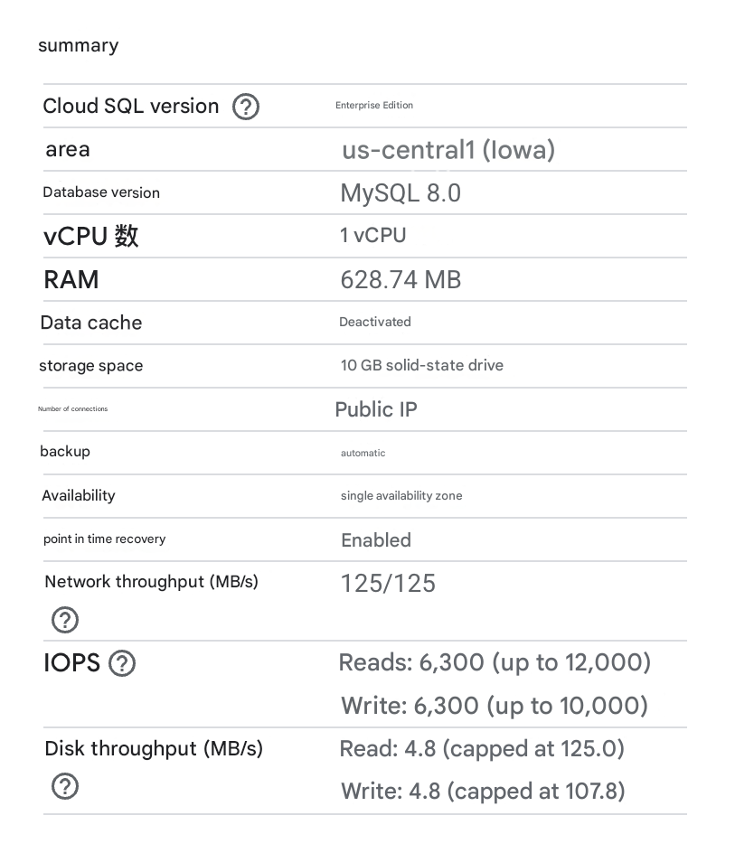
  <br><em>Figure 1. cloudsql_summary</em>
</p>

- **Connection Details:**  
<p align="center">
    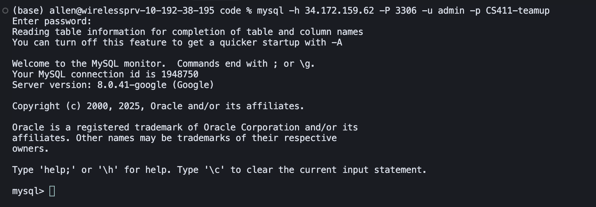
  <br><em>Figure 2. cloudsql_connection</em>
</p>


### 1.2 Table Creation (DDL)

The following Data Definition Language (DDL) commands were executed to create all main tables for our application database on MySQL 8.0 (GCP Cloud SQL).  
Each table includes primary keys, foreign keys, and attribute constraints consistent with our logical schema from Stage 2.  
All commands were successfully executed in the Cloud SQL instance, as shown in the screenshots below.

---

#### **Table 1 — Term**
Stores academic term information such as name, start date, and end date.
```sql
CREATE TABLE Term (
    term_id      VARCHAR(32) PRIMARY KEY,
    name         VARCHAR(64) NOT NULL UNIQUE,
    start_date   DATE NOT NULL,
    end_date     DATE NOT NULL
);
```

- **Operation Screenshot:**  
<p align="center">
    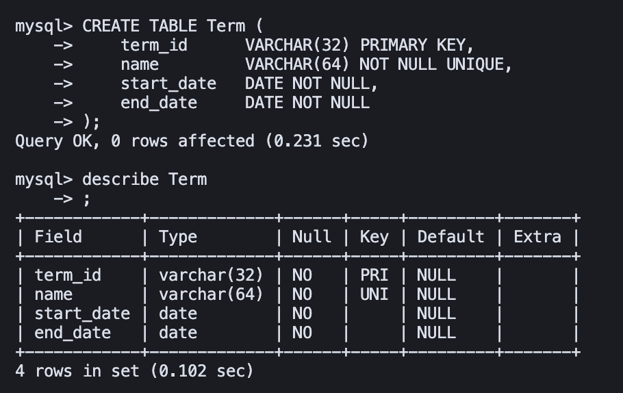
  <br><em>Figure 3. Table create for Term </em>
</p>

#### **Table 2 — Course**
Defines course metadata and links each course to a term.
```sql
CREATE TABLE Course (
    course_id    VARCHAR(32) PRIMARY KEY,
    term_id      VARCHAR(32) NOT NULL,
    subject      VARCHAR(16) NOT NULL,
    number       VARCHAR(16) NOT NULL,
    title        VARCHAR(128) NOT NULL,
    credits      DECIMAL(3,1) NOT NULL,
    FOREIGN KEY (term_id) REFERENCES Term(term_id)
);
```

- **Operation Screenshot:**  
<p align="center">
    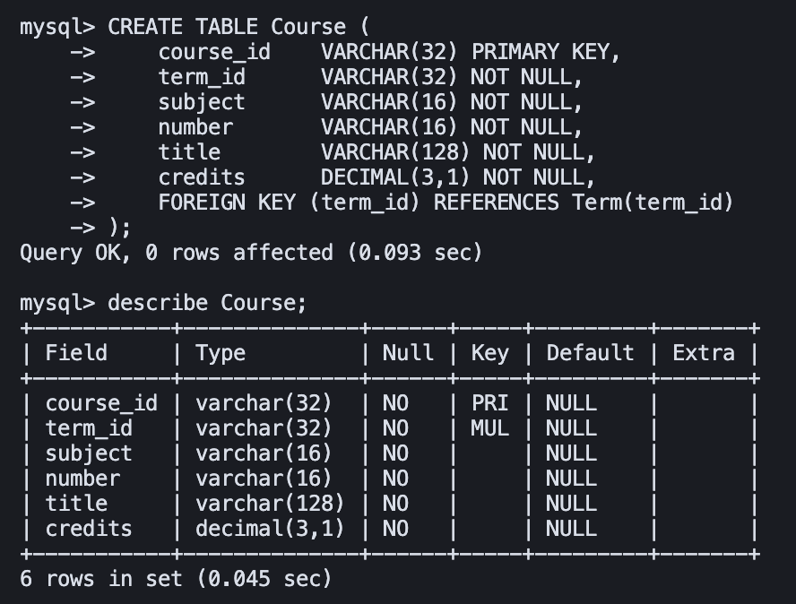
  <br><em>Figure 4. Table create for Course</em>
</p>

#### **Table 3 — Section**
Represents individual course sections and class meeting details.
```sql
CREATE TABLE Section (
    course_id     VARCHAR(32) NOT NULL,
    crn           VARCHAR(16) NOT NULL,
    instructor    VARCHAR(128),
    meeting_time  VARCHAR(128),
    location      VARCHAR(128),
    delivery_mode VARCHAR(32),
    PRIMARY KEY (course_id, crn),
    FOREIGN KEY (course_id) REFERENCES Course(course_id)
);
```

- **Operation Screenshot:**  
<p align="center">
    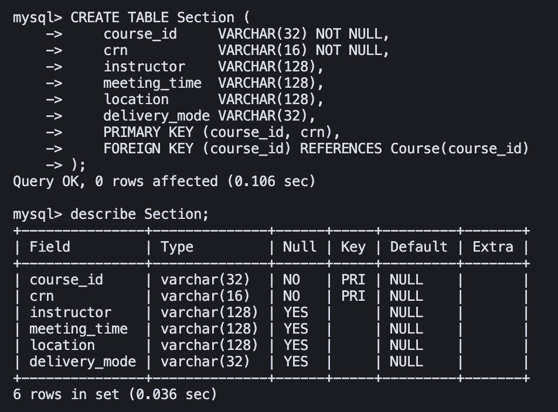
  <br><em>Figure 5. Table create for Section</em>
</p>

#### **Table 4 — User**
Stores platform user profiles and academic information.
```sql
CREATE TABLE User (
    user_id       INT PRIMARY KEY,
    netid         VARCHAR(64) UNIQUE NOT NULL,
    email         VARCHAR(128) UNIQUE NOT NULL,
    phone_number  VARCHAR(32),
    display_name  VARCHAR(128),
    avatar_url    VARCHAR(256),
    bio           VARCHAR(1024),
    score         DECIMAL(4,1),
    major         VARCHAR(64),
    grade         VARCHAR(16)
);
```

- **Operation Screenshot:**  
<p align="center">
    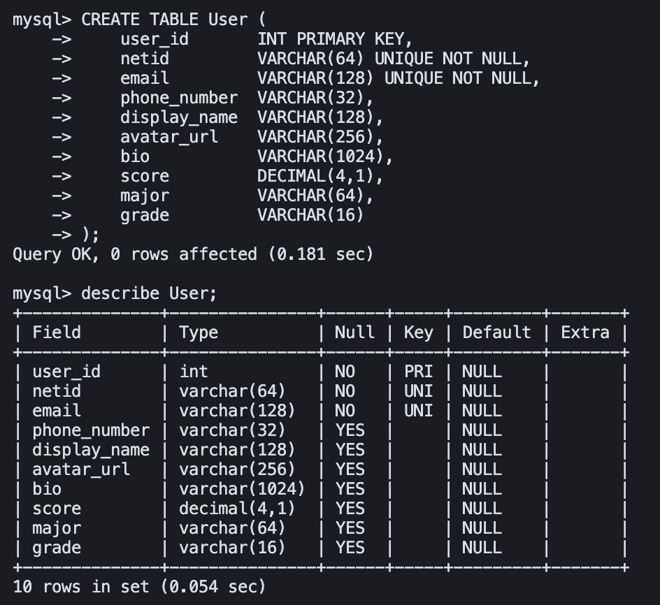
  <br><em>Figure 6. Table create for User</em>
</p>

#### **Table 5 — Skill**
Maintains a catalog of skills that users or posts may reference.
```sql
CREATE TABLE Skill (
    skill_id   INT PRIMARY KEY,
    name       VARCHAR(64) UNIQUE NOT NULL,
    category   VARCHAR(64)
);
```

- **Operation Screenshot:**  
<p align="center">
    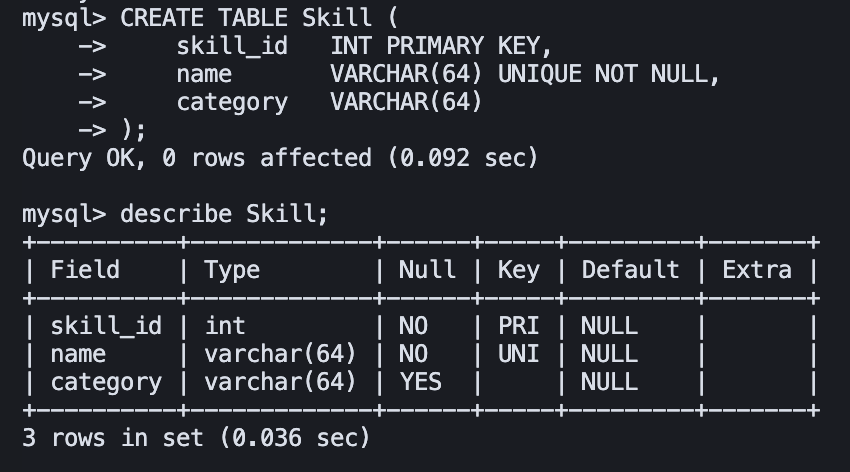
  <br><em>Figure 7. Table create for Skill</em>
</p>

#### **Table 6 — UserSkill**
Implements a many-to-many relationship between User and Skill, including skill proficiency level.
```sql
CREATE TABLE UserSkill (
    user_id INT NOT NULL,
    skill_id INT NOT NULL,
    level VARCHAR(16),
    PRIMARY KEY (user_id, skill_id),
    FOREIGN KEY (user_id) REFERENCES User(user_id),
    FOREIGN KEY (skill_id) REFERENCES Skill(skill_id)
);
```

- **Operation Screenshot:**  
<p align="center">
    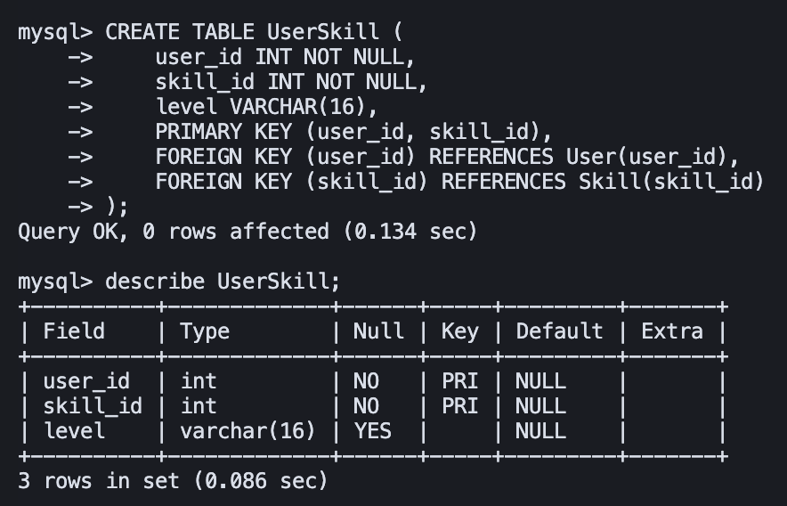
  <br><em>Figure 8. Table create for UserSkill</em>
</p>

#### **Table 7 — Team**
Represents project teams within specific course sections.
```sql
CREATE TABLE Team (
    team_id      INT PRIMARY KEY,
    course_id    VARCHAR(32) NOT NULL,
    section_id   VARCHAR(16) NOT NULL,
    team_name    VARCHAR(128) UNIQUE NOT NULL,
    target_size  INT,
    notes        VARCHAR(1024),
    status       VARCHAR(16),
    FOREIGN KEY (course_id, section_id) REFERENCES Section(course_id, crn)
);
```

- **Operation Screenshot:**  
<p align="center">
    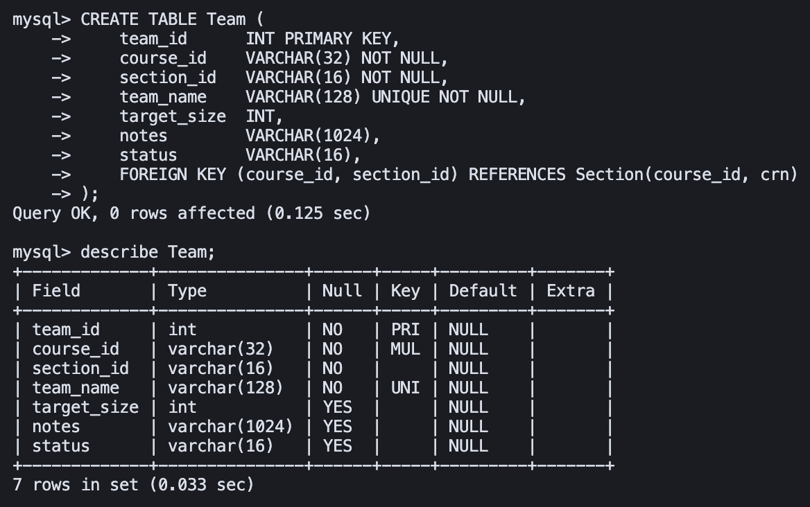
  <br><em>Figure 9. Table create for Team</em>
</p>

#### **Table 8 — TeamMember**
Links users to teams and records their role and join time.
```sql
CREATE TABLE TeamMember (
    team_id   INT NOT NULL,
    user_id   INT NOT NULL,
    role      VARCHAR(32),
    joined_at TIMESTAMP DEFAULT CURRENT_TIMESTAMP,
    PRIMARY KEY (team_id, user_id),
    FOREIGN KEY (team_id) REFERENCES Team(team_id),
    FOREIGN KEY (user_id) REFERENCES User(user_id)
);
```

- **Operation Screenshot:**  
<p align="center">
    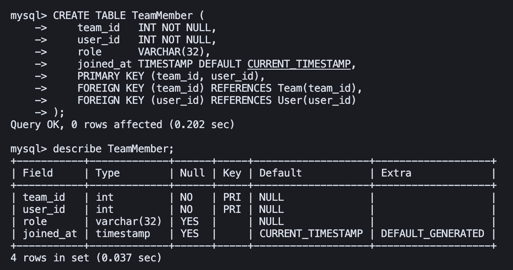
  <br><em>Figure 10. Table create for TeamMember</em>
</p>

#### **Table 9 — Post**
Contains posts created by users within teams.
```sql
CREATE TABLE Post (
    post_id     INT PRIMARY KEY,
    user_id     INT NOT NULL,
    team_id     INT NOT NULL,
    title       VARCHAR(128) NOT NULL,
    content     VARCHAR(4000) NOT NULL,
    created_at  TIMESTAMP DEFAULT CURRENT_TIMESTAMP,
    updated_at  TIMESTAMP DEFAULT CURRENT_TIMESTAMP,
    FOREIGN KEY (user_id) REFERENCES User(user_id),
    FOREIGN KEY (team_id) REFERENCES Team(team_id)
);
```

- **Operation Screenshot:**  
<p align="center">
    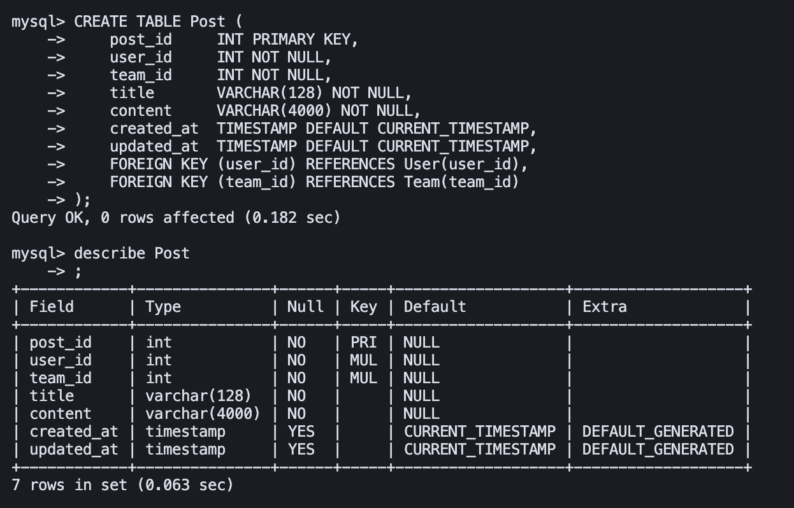
  <br><em>Figure 11. Table create for Post</em>
</p>

#### **Table 10 — Comment**
Stores user comments on posts, supporting nested replies.
```sql
CREATE TABLE Comment (
    comment_id         INT PRIMARY KEY,
    post_id            INT NOT NULL,
    user_id            INT NOT NULL,
    parent_comment_id  INT,
    content            VARCHAR(2000) NOT NULL,
    status             VARCHAR(16),
    created_at         TIMESTAMP DEFAULT CURRENT_TIMESTAMP,
    updated_at         TIMESTAMP DEFAULT CURRENT_TIMESTAMP,
    FOREIGN KEY (post_id) REFERENCES Post(post_id),
    FOREIGN KEY (user_id) REFERENCES User(user_id),
    FOREIGN KEY (parent_comment_id) REFERENCES Comment(comment_id)
);
```

- **Operation Screenshot:**  
<p align="center">
    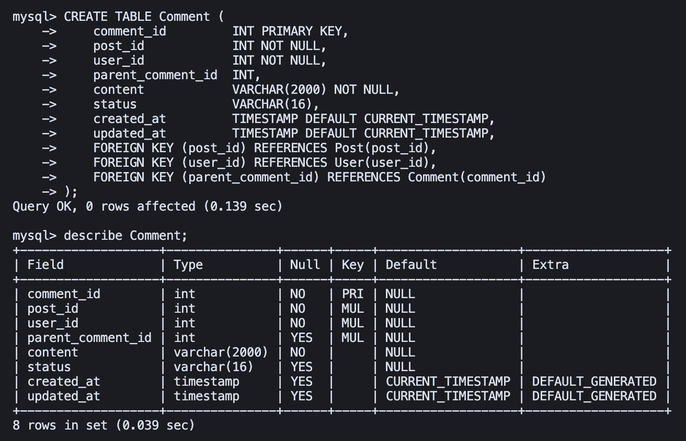
  <br><em>Figure 12. Table create for Comment</em>
</p>

#### **Table 11 — MatchRequest**
Records users' join requests to teams via posts.
```sql
CREATE TABLE MatchRequest (
    request_id    INT PRIMARY KEY,
    from_user_id  INT NOT NULL,
    to_team_id    INT NOT NULL,
    post_id       INT,
    message       VARCHAR(1024),
    status        VARCHAR(16),
    created_at    TIMESTAMP DEFAULT CURRENT_TIMESTAMP,
    FOREIGN KEY (from_user_id) REFERENCES User(user_id),
    FOREIGN KEY (to_team_id) REFERENCES Team(team_id),
    FOREIGN KEY (post_id) REFERENCES Post(post_id)
);
```

- **Operation Screenshot:**  
<p align="center">
    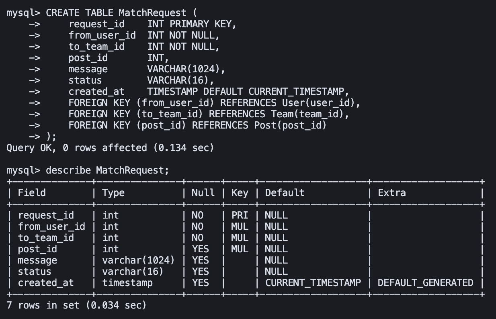
  <br><em>Figure 13. Table create for MatchRequest</em>
</p>

#### **Table 12 — PostSkill**
Defines the many-to-many relation between posts and required skills.
```sql
CREATE TABLE PostSkill (
    post_id  INT NOT NULL,
    skill_id INT NOT NULL,
    PRIMARY KEY (post_id, skill_id),
    FOREIGN KEY (post_id) REFERENCES Post(post_id),
    FOREIGN KEY (skill_id) REFERENCES Skill(skill_id)
);
```

- **Operation Screenshot:**  
<p align="center">
    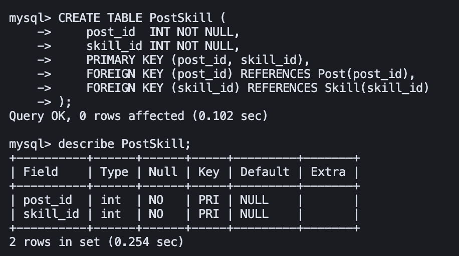
  <br><em>Figure 14. Table create for PostSkill</em>
</p>

---

### 1.3 Data Insertion

#### **Data Source Overview**

Our database contains a combination of **real academic data** and **synthetic user-generated content** to support comprehensive testing and demonstration of our team formation platform.

**Data Sources:**

1. **Course Catalog Data** (Real Data)
   - Complete Spring 2025 course offerings from UIUC
   - 12,000+ rows of course metadata, sections, instructors, schedules, and locations
   - **Dataset**: [`course-catalog.csv`](../data/course-catalog.csv)

2. **User Profiles** (Synthetic Data)
   - 1,000+ realistic student profiles generated using LLM
   - Includes NetID, email, display names, bios, majors, and grade levels
   - **Dataset**: [`user.csv`](../data/user.csv)

3. **Team Data** (Synthetic Data)
   - 630+ team formations linked to actual course sections
   - Includes team names, target sizes, status, and course associations
   - **Dataset**: [`team.csv`](../data/team.csv)

4. **Social Content Data** (Synthetic Data)
   - 990+ posts and 1,050+ comments generated for team discussions
   - 1,970+ team member relationships
   - **Datasets**: [`post.csv`](../data/post.csv), [`comment.csv`](../data/comment.csv), [`team_member.csv`](../data/team_member.csv)


#### **Insertion Method**

We implemented Python-based ETL pipelines to import data from CSV files into our MySQL database. The process involved:

**Course Data Import:**
- **Data Source**: Real UIUC Spring 2025 course catalog CSV (12,000+ rows)
- **Script**: `import_course_data.py` - Python script using `mysql-connector-python`
- **Data Transformation**: 
  - Extracted and cleaned course information
  - Combined room and building into location field
  - Concatenated meeting days, start time, and end time into meeting_time field
  - Generated course_id from subject and number (e.g., "CS101")
  - Handled online courses with ARRANGED time slots
- **Subject Filtering**: Filtered by subject codes (CS, ECE, MATH, PHYS, CHEM, STAT, IS, MUS, etc.)
- **Validation**: Automated handling of duplicate entries and foreign key constraints
- **Process**: Sequential insertion of Term → Course → Section to maintain referential integrity

**User Data Import:**
- **Data Source**: Synthetic user profiles CSV (1,000+ rows)
- **Script**: `import_user_data.py` - Python script using `mysql-connector-python`
- **Data Transformation**:
  - Validated all required fields (user_id, netid, email)
  - Handled optional fields (phone_number, bio, avatar_url)
  - Enforced field length constraints (VARCHAR limits)
  - Converted score to DECIMAL format
- **Validation**: Automated handling of duplicate entries and unique constraints
- **Process**: Bulk insert of user records with error handling

**Team & Social Content Data Import:**
- **Team Data**: Imported 631 teams from `team.csv` with course-section associations
  - Generated course_id in format `sp25{subject}{number}` (e.g., `sp25CS411`)
  - Randomly matched teams to valid course-sections in the database
  - Generated team names based on course identifiers
- **TeamMember Data**: Imported 1,971 team member relationships
  - Linked users to teams with role assignments (owner, member)
- **Post Data**: Imported 992 posts from `post.csv`
  - Posts linked to existing teams and users
  - Removed invalid section_id field not in database schema
- **Comment Data**: Imported 1,051 comments from `comment.csv`
  - Comments linked to existing posts with optional parent comments for nested replies

#### **Table Row Count Verification**

After data insertion, we executed count queries to verify that at least three tables contain more than 1000 rows each.

**Verification Command:**
```sql
SELECT 'Term' as table_name, COUNT(*) as count FROM Term 
UNION ALL SELECT 'Course', COUNT(*) FROM Course 
UNION ALL SELECT 'Section', COUNT(*) FROM Section 
UNION ALL SELECT 'User', COUNT(*) FROM User 
UNION ALL SELECT 'Team', COUNT(*) FROM Team 
UNION ALL SELECT 'TeamMember', COUNT(*) FROM TeamMember 
UNION ALL SELECT 'Post', COUNT(*) FROM Post 
UNION ALL SELECT 'Comment', COUNT(*) FROM Comment 
UNION ALL SELECT 'Skill', COUNT(*) FROM Skill 
UNION ALL SELECT 'UserSkill', COUNT(*) FROM UserSkill 
UNION ALL SELECT 'MatchRequest', COUNT(*) FROM MatchRequest 
UNION ALL SELECT 'PostSkill', COUNT(*) FROM PostSkill;
```

**Result Screenshot:**
<p align="center">
    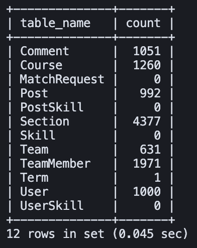
  <br><em>Figure 15. Verification of row counts for all database tables</em>
</p>

**Insertion Results Summary:**

| **Table Name** | **Rows Inserted** |
|----------------|-------------------|
| Term | 1 |
| **Course** | **1,260** |
| **Section** | **4,377** |
| **User** | **1,000** |
| Team | 631 |
| **TeamMember** | **1,971** |
| Post | 992 |
| Comment | 1,051 |
| Skill | 0 |
| UserSkill | 0 |
| MatchRequest | 0 |
| PostSkill | 0 |

---

### II. Advanced SQL Queries

This section presents four advanced SQL queries that utilize multiple relational operations such as JOIN, GROUP BY, SET operators, and subqueries.  
Each query includes its purpose, SQL statement, and a screenshot of the top 15 results.

---

#### **Query 1 — [Query Name Here]**
**Used SQL Features:** (e.g., JOIN + GROUP BY)

(SQL)
SELECT ... FROM ...  
WHERE ...  
GROUP BY ...  
ORDER BY ...  
LIMIT 15;

**Explanation:**  
Describe what the query is intended to do (e.g., “Shows the total number of students enrolled in each course”).

**Result Screenshot:**  


---

#### **Query 2 — [Query Name Here]**
**Used SQL Features:** (e.g., Aggregation + Subquery)

(SQL)
SELECT ... FROM ...  
WHERE ... IN (SELECT ...)  
GROUP BY ...  
LIMIT 15;

**Explanation:**  
Describe the query purpose (e.g., “Finds users who participated in multiple teams”).

**Result Screenshot:**  


---

#### **Query 3 — [Query Name Here]**
**Used SQL Features:** (e.g., SET Operators)

(SQL)
(SELECT ... FROM ...)  
UNION  
(SELECT ... FROM ...)  
LIMIT 15;

**Explanation:**  
Briefly explain what this query achieves.

**Result Screenshot:**  


---

#### **Query 4 — [Query Name Here]**
**Used SQL Features:** (e.g., Aggregation + HAVING)

(SQL)
SELECT ... FROM ...  
GROUP BY ...  
HAVING ...  
LIMIT 15;

**Explanation:**  
Briefly describe the purpose of this query.

**Result Screenshot:**  


---

### III. Indexing & Performance Analysis

This section evaluates query performance before and after applying indexing strategies using the `EXPLAIN ANALYZE` command.  
Each query’s execution cost is compared under different index configurations.

---

#### **3.1 Baseline (No Index)**

The following table summarizes the cost of each query before applying any index optimization.

| **Query** | **Cost (Before Index)** | **Screenshot** |
|------------|-------------------------|----------------|
| Query 1 | (fill later) |  |
| Query 2 | (fill later) |  |
| Query 3 | (fill later) |  |
| Query 4 | (fill later) |  |

---

#### **3.2 Different Index Designs**

For each advanced query, we tested at least three different indexing strategies and measured their impact on cost.

**Index Design 1 — Join Columns**

(SQL)
CREATE INDEX idx_user_course ON Enrollment(user_id, course_id);

**Observed Effect:**  
Describe the impact (e.g., “Improved JOIN performance between Enrollment and Course by reducing cost 35%.”)

**Before vs After Cost Comparison:**  
| Query | Before | After | Change | Screenshot |
|--------|---------|--------|---------|-------------|
| Query 1 | (fill later) | (fill later) | (fill later) |  |

---

**Index Design 2 — Filter Columns**

(SQL)
CREATE INDEX idx_course_term ON Course(term_id);

**Observed Effect:**  
Describe performance change (e.g., “Improved filtering on term-based queries.”)

| Query | Before | After | Change | Screenshot |
|--------|---------|--------|---------|-------------|
| Query 3 | (fill later) | (fill later) | (fill later) |  |

---

**Index Design 3 — Aggregation Columns**

(SQL)
CREATE INDEX idx_course_subject ON Course(subject);

**Observed Effect:**  
Describe result (e.g., “Reduced grouping cost by 25% in aggregated queries.”)

| Query | Before | After | Change | Screenshot |
|--------|---------|--------|---------|-------------|
| Query 4 | (fill later) | (fill later) | (fill later) |  |

---

#### **3.3 Final Index Choice**

| **Index Name** | **Columns** | **Purpose / Reason for Selection** |
|-----------------|-------------|------------------------------------|
| idx_user_course | (user_id, course_id) | Optimizes JOIN between Enrollment and Course |
| idx_course_term | (term_id) | Improves filtering by term |
| idx_course_subject | (subject) | Enhances GROUP BY aggregation efficiency |

**Explanation:**  
Summarize which indices were chosen as the final design and explain the reasoning behind them.  
If no performance gain was observed, explain possible causes such as small dataset size, data distribution, or query structure limitations.

(Optional: include performance trend chart)


