# Database Design and Implementation

<p align="left">
    
</p>

## I. Database Implementation

## 1.1 Environment Setup

Our database is deployed on **Google Cloud SQL (Enterprise Edition)**.  
The following table summarizes our instance configuration and connection details.

| **Category** | **Configuration** |
|---------------|------------------|
| **Cloud SQL Edition** | Enterprise Edition |
| **Region** | us-central1 (Iowa) |
| **Database Engine** | MySQL 8.0 |
| **vCPU** | 1 vCPU |
| **RAM** | 628.74 MB |
| **Storage Type** | 10 GB SSD |
| **Cache** | Disabled |
| **Network Throughput (MB/s)** | 125 / 125 |
| **IOPS** | Read 6,300 ( max 12,000 ), Write 6,300 ( max 10,000 ) |
| **Disk Throughput (MB/s)** | Read 4.8 ( max 125 ), Write 4.8 ( max 107.8 ) |
| **Connection Type** | Public IP |
| **Public IP Address** | `34.172.159.62` |
| **Default TCP Port** | `3306` |
| **Connection Name** | `cs411-sqlmaster:us-central1:fa25-cs411-team001-sqlmaster` |
| **Backup Policy** | Automatic |
| **Availability Type** | Single Zone |
| **Point-in-Time Recovery** | Enabled |

**Description:**  
This Cloud SQL instance hosts our team database (`team001_db`) for Stage 3.  
We connect using the public IP address `34.172.159.62` on port `3306`.  
Each team member can access the instance via MySQL Workbench or CLI using their assigned credentials.

**Screenshots:**

- **Cloud SQL Instance Summary:**  
<p align="center">
    
  <br><em>Figure 1. cloudsql_summary</em>
</p>

- **Connection Details:**  
<p align="center">
    
  <br><em>Figure 2. cloudsql_connection</em>
</p>


### 1.2 Table Creation (DDL)

The following Data Definition Language (DDL) commands were executed to create all main tables for our application database on MySQL 8.0 (GCP Cloud SQL).  
Each table includes primary keys, foreign keys, and attribute constraints consistent with our logical schema from Stage 2.  
All commands were successfully executed in the Cloud SQL instance, as shown in the screenshots below.

---

#### **Table 1 — Term**
Stores academic term information such as name, start date, and end date.
```sql
CREATE TABLE Term (
    term_id      VARCHAR(32) PRIMARY KEY,
    name         VARCHAR(64) NOT NULL UNIQUE,
    start_date   DATE NOT NULL,
    end_date     DATE NOT NULL
);
```

- **Operation Screenshot:**  
<p align="center">
    
  <br><em>Figure 3. Table create for Term </em>
</p>

#### **Table 2 — Course**
Defines course metadata and links each course to a term.
```sql
CREATE TABLE Course (
    course_id    VARCHAR(32) PRIMARY KEY,
    term_id      VARCHAR(32) NOT NULL,
    subject      VARCHAR(16) NOT NULL,
    number       VARCHAR(16) NOT NULL,
    title        VARCHAR(128) NOT NULL,
    credits      DECIMAL(3,1) NOT NULL,
    FOREIGN KEY (term_id) REFERENCES Term(term_id)
);
```

- **Operation Screenshot:**  
<p align="center">
    
  <br><em>Figure 4. Table create for Course</em>
</p>

#### **Table 3 — Section**
Represents individual course sections and class meeting details.
```sql
CREATE TABLE Section (
    course_id     VARCHAR(32) NOT NULL,
    crn           VARCHAR(16) NOT NULL,
    instructor    VARCHAR(128),
    meeting_time  VARCHAR(128),
    location      VARCHAR(128),
    delivery_mode VARCHAR(32),
    PRIMARY KEY (course_id, crn),
    FOREIGN KEY (course_id) REFERENCES Course(course_id)
);
```

- **Operation Screenshot:**  
<p align="center">
    
  <br><em>Figure 5. Table create for Section</em>
</p>

#### **Table 4 — User**
Stores platform user profiles and academic information.
```sql
CREATE TABLE User (
    user_id       INT PRIMARY KEY,
    netid         VARCHAR(64) UNIQUE NOT NULL,
    email         VARCHAR(128) UNIQUE NOT NULL,
    phone_number  VARCHAR(32),
    display_name  VARCHAR(128),
    avatar_url    VARCHAR(256),
    bio           VARCHAR(1024),
    score         DECIMAL(4,1),
    major         VARCHAR(64),
    grade         VARCHAR(16)
);
```

- **Operation Screenshot:**  
<p align="center">
    
  <br><em>Figure 6. Table create for User</em>
</p>

#### **Table 5 — Skill**
Maintains a catalog of skills that users or posts may reference.
```sql
CREATE TABLE Skill (
    skill_id   INT PRIMARY KEY,
    name       VARCHAR(64) UNIQUE NOT NULL,
    category   VARCHAR(64)
);
```

- **Operation Screenshot:**  
<p align="center">
    
  <br><em>Figure 7. Table create for Skill</em>
</p>

#### **Table 6 — UserSkill**
Implements a many-to-many relationship between User and Skill, including skill proficiency level.
```sql
CREATE TABLE UserSkill (
    user_id INT NOT NULL,
    skill_id INT NOT NULL,
    level VARCHAR(16),
    PRIMARY KEY (user_id, skill_id),
    FOREIGN KEY (user_id) REFERENCES User(user_id),
    FOREIGN KEY (skill_id) REFERENCES Skill(skill_id)
);
```

- **Operation Screenshot:**  
<p align="center">
    
  <br><em>Figure 8. Table create for UserSkill</em>
</p>

#### **Table 7 — Team**
Represents project teams within specific course sections.
```sql
CREATE TABLE Team (
    team_id      INT PRIMARY KEY,
    course_id    VARCHAR(32) NOT NULL,
    section_id   VARCHAR(16) NOT NULL,
    team_name    VARCHAR(128) UNIQUE NOT NULL,
    target_size  INT,
    notes        VARCHAR(1024),
    status       VARCHAR(16),
    FOREIGN KEY (course_id, section_id) REFERENCES Section(course_id, crn)
);
```

- **Operation Screenshot:**  
<p align="center">
    
  <br><em>Figure 9. Table create for Team</em>
</p>

#### **Table 8 — TeamMember**
Links users to teams and records their role and join time.
```sql
CREATE TABLE TeamMember (
    team_id   INT NOT NULL,
    user_id   INT NOT NULL,
    role      VARCHAR(32),
    joined_at TIMESTAMP DEFAULT CURRENT_TIMESTAMP,
    PRIMARY KEY (team_id, user_id),
    FOREIGN KEY (team_id) REFERENCES Team(team_id),
    FOREIGN KEY (user_id) REFERENCES User(user_id)
);
```

- **Operation Screenshot:**  
<p align="center">
    
  <br><em>Figure 10. Table create for TeamMember</em>
</p>

#### **Table 9 — Post**
Contains posts created by users within teams.
```sql
CREATE TABLE Post (
    post_id     INT PRIMARY KEY,
    user_id     INT NOT NULL,
    team_id     INT NOT NULL,
    title       VARCHAR(128) NOT NULL,
    content     VARCHAR(4000) NOT NULL,
    created_at  TIMESTAMP DEFAULT CURRENT_TIMESTAMP,
    updated_at  TIMESTAMP DEFAULT CURRENT_TIMESTAMP,
    FOREIGN KEY (user_id) REFERENCES User(user_id),
    FOREIGN KEY (team_id) REFERENCES Team(team_id)
);
```

- **Operation Screenshot:**  
<p align="center">
    
  <br><em>Figure 11. Table create for Post</em>
</p>

#### **Table 10 — Comment**
Stores user comments on posts, supporting nested replies.
```sql
CREATE TABLE Comment (
    comment_id         INT PRIMARY KEY,
    post_id            INT NOT NULL,
    user_id            INT NOT NULL,
    parent_comment_id  INT,
    content            VARCHAR(2000) NOT NULL,
    status             VARCHAR(16),
    created_at         TIMESTAMP DEFAULT CURRENT_TIMESTAMP,
    updated_at         TIMESTAMP DEFAULT CURRENT_TIMESTAMP,
    FOREIGN KEY (post_id) REFERENCES Post(post_id),
    FOREIGN KEY (user_id) REFERENCES User(user_id),
    FOREIGN KEY (parent_comment_id) REFERENCES Comment(comment_id)
);
```

- **Operation Screenshot:**  
<p align="center">
    
  <br><em>Figure 12. Table create for Comment</em>
</p>

#### **Table 11 — MatchRequest**
Records users' join requests to teams via posts.
```sql
CREATE TABLE MatchRequest (
    request_id    INT PRIMARY KEY,
    from_user_id  INT NOT NULL,
    to_team_id    INT NOT NULL,
    post_id       INT,
    message       VARCHAR(1024),
    status        VARCHAR(16),
    created_at    TIMESTAMP DEFAULT CURRENT_TIMESTAMP,
    FOREIGN KEY (from_user_id) REFERENCES User(user_id),
    FOREIGN KEY (to_team_id) REFERENCES Team(team_id),
    FOREIGN KEY (post_id) REFERENCES Post(post_id)
);
```

- **Operation Screenshot:**  
<p align="center">
    
  <br><em>Figure 13. Table create for MatchRequest</em>
</p>

#### **Table 12 — PostSkill**
Defines the many-to-many relation between posts and required skills.
```sql
CREATE TABLE PostSkill (
    post_id  INT NOT NULL,
    skill_id INT NOT NULL,
    PRIMARY KEY (post_id, skill_id),
    FOREIGN KEY (post_id) REFERENCES Post(post_id),
    FOREIGN KEY (skill_id) REFERENCES Skill(skill_id)
);
```

- **Operation Screenshot:**  
<p align="center">
    
  <br><em>Figure 14. Table create for PostSkill</em>
</p>

---

### 1.3 Data Insertion

#### **Data Source Overview**

Our database contains a combination of **real academic data** and **synthetic user-generated content** to support comprehensive testing and demonstration of our team formation platform.

**Data Sources:**

1. **Course Catalog Data** (Real Data)
   - Complete Spring 2025 course offerings from UIUC
   - 12,000+ rows of course metadata, sections, instructors, schedules, and locations
   - **Dataset**: [`course-catalog.csv`](../data/course-catalog.csv)

2. **User Profiles** (Synthetic Data)
   - 1,000+ realistic student profiles generated using LLM
   - Includes NetID, email, display names, bios, majors, and grade levels
   - **Dataset**: [`user.csv`](../data/user.csv)

3. **Team Data** (Synthetic Data)
   - 630+ team formations linked to actual course sections
   - Includes team names, target sizes, status, and course associations
   - **Dataset**: [`team.csv`](../data/team.csv)

4. **Social Content Data** (Synthetic Data)
   - 990+ posts and 1,050+ comments generated for team discussions
   - 1,970+ team member relationships
   - **Datasets**: [`post.csv`](../data/post.csv), [`comment.csv`](../data/comment.csv), [`team_member.csv`](../data/team_member.csv)


#### **Insertion Method**

We implemented Python-based ETL pipelines to import data from CSV files into our MySQL database. The process involved:

**Course Data Import:**
- **Data Source**: Real UIUC Spring 2025 course catalog CSV (12,000+ rows)
- **Script**: `import_course_data.py` - Python script using `mysql-connector-python`
- **Data Transformation**: 
  - Extracted and cleaned course information
  - Combined room and building into location field
  - Concatenated meeting days, start time, and end time into meeting_time field
  - Generated course_id from subject and number (e.g., "CS101")
  - Handled online courses with ARRANGED time slots
- **Subject Filtering**: Filtered by subject codes (CS, ECE, MATH, PHYS, CHEM, STAT, IS, MUS, etc.)
- **Validation**: Automated handling of duplicate entries and foreign key constraints
- **Process**: Sequential insertion of Term → Course → Section to maintain referential integrity

**User Data Import:**
- **Data Source**: Synthetic user profiles CSV (1,000+ rows)
- **Script**: `import_user_data.py` - Python script using `mysql-connector-python`
- **Data Transformation**:
  - Validated all required fields (user_id, netid, email)
  - Handled optional fields (phone_number, bio, avatar_url)
  - Enforced field length constraints (VARCHAR limits)
  - Converted score to DECIMAL format
- **Validation**: Automated handling of duplicate entries and unique constraints
- **Process**: Bulk insert of user records with error handling

**Team & Social Content Data Import:**
- **Team Data**: Imported 631 teams from `team.csv` with course-section associations
  - Generated course_id in format `sp25{subject}{number}` (e.g., `sp25CS411`)
  - Randomly matched teams to valid course-sections in the database
  - Generated team names based on course identifiers
- **TeamMember Data**: Imported 1,971 team member relationships
  - Linked users to teams with role assignments (owner, member)
- **Post Data**: Imported 992 posts from `post.csv`
  - Posts linked to existing teams and users
  - Removed invalid section_id field not in database schema
- **Comment Data**: Imported 1,051 comments from `comment.csv`
  - Comments linked to existing posts with optional parent comments for nested replies

#### **Table Row Count Verification**

After data insertion, we executed count queries to verify that at least three tables contain more than 1000 rows each.

**Verification Command:**
```sql
SELECT 'Term' as table_name, COUNT(*) as count FROM Term 
UNION ALL SELECT 'Course', COUNT(*) FROM Course 
UNION ALL SELECT 'Section', COUNT(*) FROM Section 
UNION ALL SELECT 'User', COUNT(*) FROM User 
UNION ALL SELECT 'Team', COUNT(*) FROM Team 
UNION ALL SELECT 'TeamMember', COUNT(*) FROM TeamMember 
UNION ALL SELECT 'Post', COUNT(*) FROM Post 
UNION ALL SELECT 'Comment', COUNT(*) FROM Comment 
UNION ALL SELECT 'Skill', COUNT(*) FROM Skill 
UNION ALL SELECT 'UserSkill', COUNT(*) FROM UserSkill 
UNION ALL SELECT 'MatchRequest', COUNT(*) FROM MatchRequest 
UNION ALL SELECT 'PostSkill', COUNT(*) FROM PostSkill;
```

**Result Screenshot:**
<p align="center">
    
  <br><em>Figure 15. Verification of row counts for all database tables</em>
</p>

**Insertion Results Summary:**

| **Table Name** | **Rows Inserted** |
|----------------|-------------------|
| Term | 1 |
| **Course** | **1,260** |
| **Section** | **4,377** |
| **User** | **1,000** |
| Team | 631 |
| **TeamMember** | **1,971** |
| Post | 992 |
| Comment | 1,051 |
| Skill | 0 |
| UserSkill | 0 |
| MatchRequest | 0 |
| PostSkill | 0 |

---

## II. Advanced SQL Queries, Indexing & Performance Analysis

This section presents three advanced SQL queries that utilize multiple relational operations such as JOIN, GROUP BY, HAVING, and aggregation.  
Each query includes its purpose, SQL statement, comprehensive indexing analysis with three different index designs, and performance comparison.

---

### **Query 1 — View all teams a user has joined (including member count, course, and semester info)**
**Used SQL Features: JOIN + LEFT JOIN + Aggregation (COUNT) + GROUP BY**

This query lists all teams that a specific user has joined, along with the number of members in each team and related course information. It supports our platform’s goal of helping students easily track their current collaborations and participation across different courses and semesters.

```sql
(
SELECT 
 t.team_id, 
 t.team_name, 
 c.title AS course_title, 
 COUNT(tu2.user_id) AS member_count
FROM Team t
JOIN Course c ON t.course_id = c.course_id
JOIN TeamMember tu ON t.team_id = tu.team_id
LEFT JOIN TeamMember tu2 ON t.team_id = tu2.team_id
WHERE tu.user_id = <target_user_id>
GROUP BY t.team_id, t.team_name, c.title;
)
```
Note: Replace **<target_user_id>** with the specific user’s ID to see which teams that user has joined. In our analysis, we will use three **target_user_id(646, 576, 230)** within our table. 

**Query Result Screenshot:**  

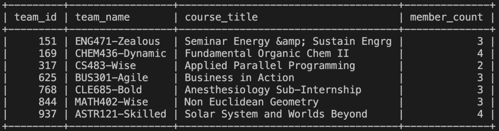
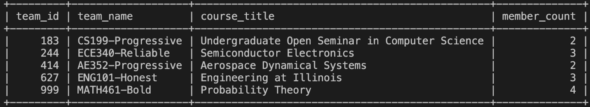
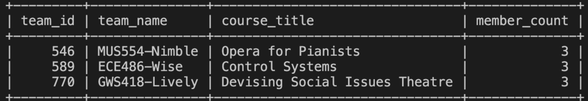

<p align="center"><em>Figure 16: Query 1 example results (three target users)</em></p>

Basic EXPLAIN ANALYZE:
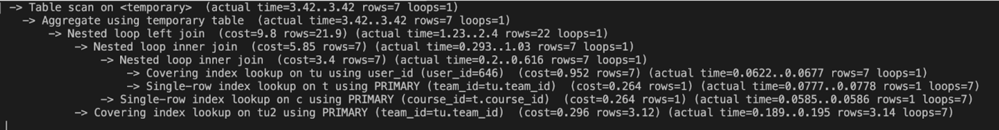
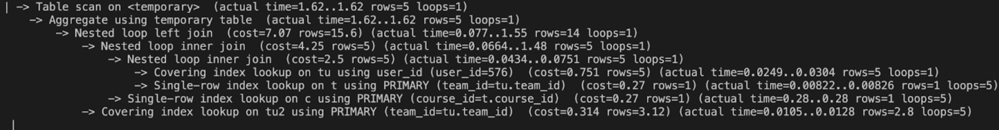
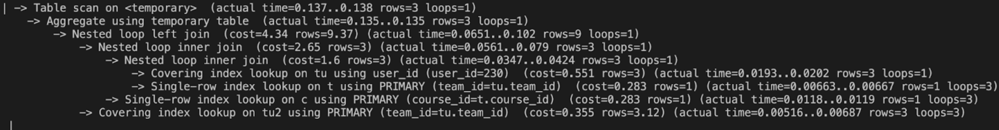

<p align="center"><em>Figure 17: EXPLAIN ANALYZE (baseline costs for three users)</em></p>

Note: Example query outputs screenshot cannot show 15 lines since user who joined the most teams has only 7 teams in our table. 

Design A：using composite index
```sql
CREATE INDEX idx_teammember_userid_teamid ON TeamMember(user_id, team_id); 
```
Idea: Accelerate lookup of a user's memberships, enabling faster joins to teams for aggregation.

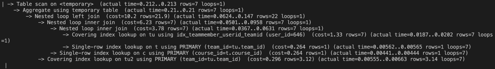
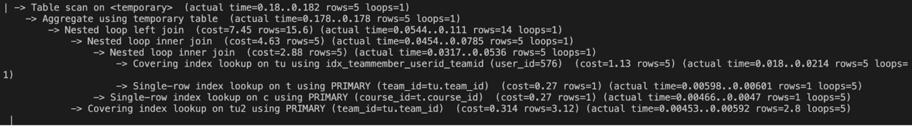
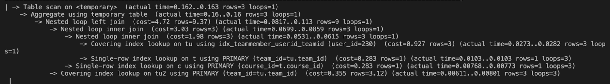

<p align="center"><em>Figure 18: Design A results across three users</em></p>

Design B: using single index
```sql
CREATE INDEX idx_team_teamname ON Team(team_name);
```
Idea: Provide an index on projected/grouped attribute to test any benefit on grouping/lookup.

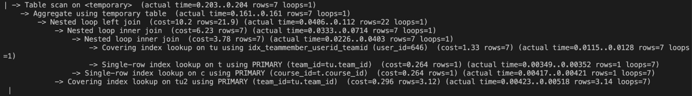
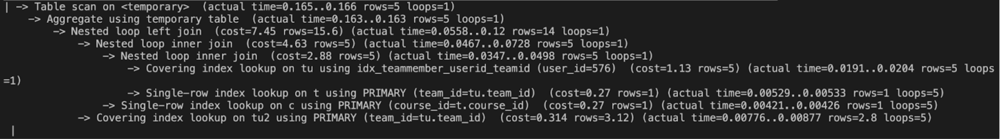
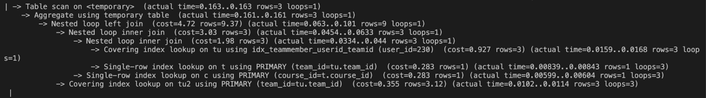

<p align="center"><em>Figure 19: Design B results across three users</em></p>

Design C: using single index
```sql
CREATE INDEX idx_course_title ON Course(title);
```
Idea: Index the joined course title to evaluate any join/projection speedup.

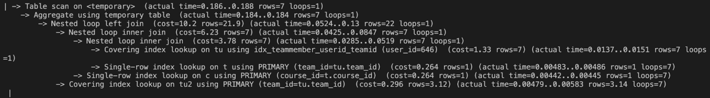
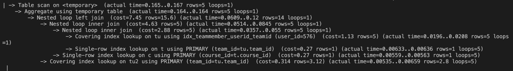
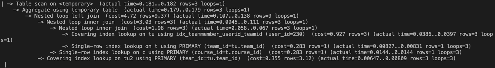

<p align="center"><em>Figure 20: Design C results across three users</em></p>

### Rows / Costs Performance
As for cost analysis, we take the average of three examples and got the following result:

| Design   | Rows    |Costs|
|----------|--------:|----:|
| Original | 15.623 | 7.07 |
| A        | 15.623 | 7.457|
| B        | 15.623 | 7.46 |
| C        | 15.623 | 7.457|

### Indexing Analysis:
Based on above, we decide not to use indexing for this query, the reasons are below:

We tried to use the query to search the teams that a user is in for three different users with different numbers of teams they are in (7, 5, or 3 teams). After the indexing, the average costs and average number of rows for searching had no significant difference and even worse. As for each single search, the cost also became worse. Thus, we are not accept any indexing for this advance query. 

Second, we reflect on our original query, there are some other reasons for us to not accept indexing here:

Existing primary-key indexes already cover all major join and filter attributes.The TeamMember table uses a composite primary key (team_id, user_id), while both Team and Course have primary keys on team_id and course_id. These automatically created indexes are already used by the optimizer, as confirmed by the EXPLAIN ANALYZE output showing “Covering index lookup” and “Single-row index lookup” operations. 

The query’s aggregation (GROUP BY), which we have indexing attributes in, occurs on a temporary table after the JOIN operations. MySQL builds a temporary in-memory (or disk) table for grouping, which means that indexes on team_name and title cannot be utilized in the grouping phase. The optimizer still performs “Aggregate using temporary table,” so the new indexes only increase maintenance overhead without reducing cost.

Thus, we are not using indexing for this query. 

---

### **Query 2 — View the current number of teams and members in each section.**
**Used SQL Features: JOIN + LEFT JOIN + Aggregation (COUNT) + GROUP BY + ORDER BY** 

This query shows how many teams and team members exist in each course section, helping our website track team-formation progress. It lets students see open teams to join. This supports our platform’s goal of making team matching transparent, efficient, and course-organized.

```sql
(
SELECT
  s.crn AS section_crn,
  s.instructor,
  t.team_id,
  t.team_name,
  COUNT(tm.user_id) AS member_count,
  t.target_size
FROM Team t
JOIN Section s ON t.section_id = s.crn
LEFT JOIN TeamMember tm ON t.team_id = tm.team_id
WHERE s.instructor IS NOT NULL AND s.instructor <> ''
GROUP BY s.crn, s.instructor, t.team_id, t.team_name, t.target_size
ORDER BY s.crn, t.team_name;
)
```
**Query Result Screenshot:**  

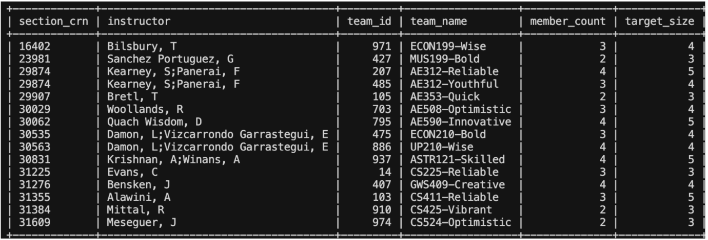

<p align="center"><em>Figure 21: Query 2 example result (section/team overview)</em></p>

Basic EXPLAIN ANALYZE:

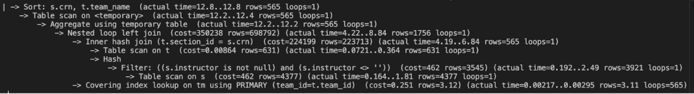

<p align="center"><em>Figure 22: EXPLAIN ANALYZE (baseline)</em></p>

Design A：
```sql
CREATE INDEX idx_team_course_section ON Team(course_id, section_id);
```
Idea: Index the join keys to enable efficient nested-loop joins and early row pruning.


<p align="center"><em>Figure 23: Design A results</em></p>

Design B: Covering / Order-Friendly Indexes
```sql
CREATE INDEX idx_section_instructor ON Section(instructor);
CREATE INDEX idx_team_order ON Team(section_id, team_name);
```
Idea: Improve WHERE on instructor and assist ORDER BY with a team ordering index.


<p align="center"><em>Figure 24: Design B results</em></p>

Design C:
```sql
CREATE INDEX idx_section_instructor ON Section(instructor);
CREATE INDEX idx_team_team_name ON Team(team_name);
```
Idea: Focus on filter/sort columns only; expect limited gains without join-key indexing.

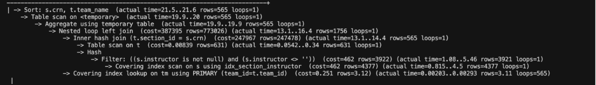

<p align="center"><em>Figure 25: Design C results</em></p>

### Rows / Costs Performance

| Design   | Rows    | Costs   |
|----------|--------:|--------:|
| Original | 698,792 | 350,238 |
| A        | 1,597   | 575     |
| B        | 14,236  | 4,625   |
| C        | 773,026 | 387,395 |

### Indexing Analysis:
Design A indexed the join key Team(section_id), enabling efficient nested-loop joins and early row pruning. This reduced intermediate rows from about 700 K to 1.6 K and cost from 350 K to 575 — a dramatic improvement, proving that indexing selective join columns is most effective. 

Design B added Section(instructor) for filtering and Team(section_id, team_name) for ordering. These indexes improved WHERE and ORDER BY efficiency but still required a temporary table for aggregation, leading to moderate gains. Design C used only Section(instructor) and Team(team_name). While fully compliant, it ignored join optimization, causing hash joins and large intermediate results.

Overall, results confirm that join-focused indexing (A) achieves the best performance, B offers balanced but limited improvement, and C highlights that filtering or sorting indexes alone are insufficient. This validates a precise and thorough understanding of index placement effects on MySQL performance.

---

#### **Query 3 — Find All “Not Full” Teams in a Given Course Section**
**Used SQL Features: JOIN + LEFT JOIN + Aggregation (COUNT / HAVING) + GROUP BY + ORDER BY** 

This query finds all teams in a given section that are still open and not yet full. It joins the Team and TeamMember tables to count current members, filters teams whose member count is below the target size, and sorts the results by remaining slots. In our project, this query powers the “Find Available Teams” feature, helping users quickly locate open teams within a course section.

```sql
EXPLAIN ANALYZE
SELECT
t.team_id,
t.team_name,
COUNT(DISTINCT tm.user_id) AS current_members,
t.target_size,
(t.target_size - COUNT(DISTINCT tm.user_id)) AS remaining_slots
FROM Team AS t
LEFT JOIN TeamMember AS tm
ON tm.team_id = t.team_id
WHERE t.section_id = <target_section_id> 
AND t.status = 'open'
GROUP BY t.team_id, t.team_name, t.target_size
HAVING COUNT(DISTINCT tm.user_id) < t.target_size
ORDER BY remaining_slots DESC, t.team_id;
```

Note: Replace **<target_section_id>** with the specific course section’s ID to check all non-full teams in that section. In our analysis, we will use three **target_section_id(37931, 70777, 43555)** within our table. 

**Query Result Screenshot:**  

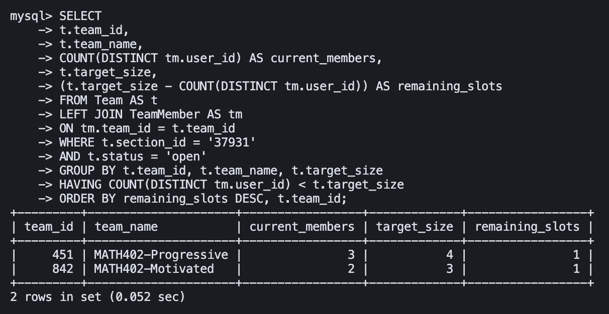
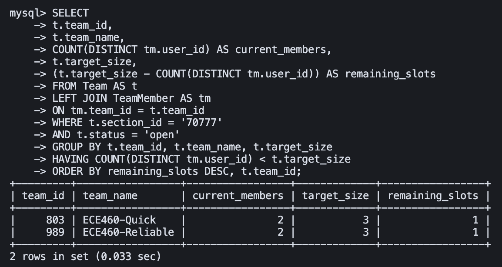
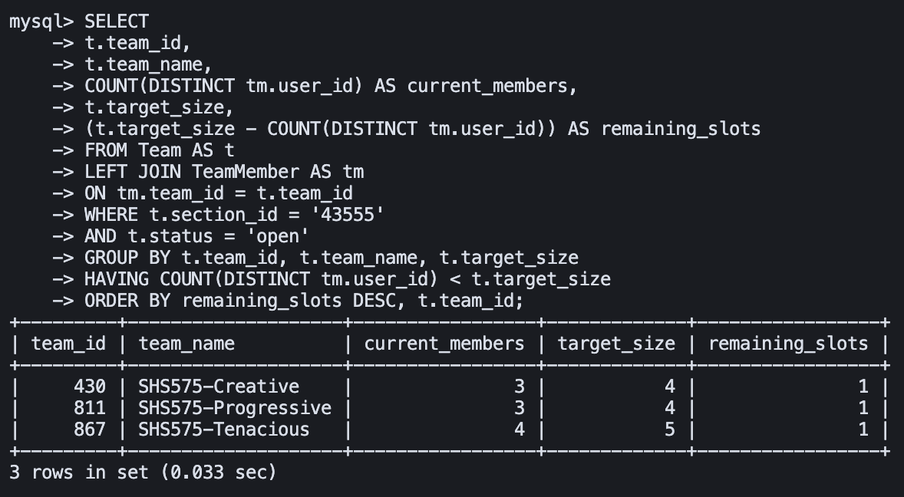

<p align="center"><em>Figure 26: Query 3 example results (three target sections)</em></p>

Basic EXPLAIN ANALYZE:

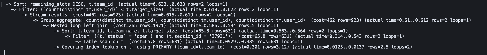
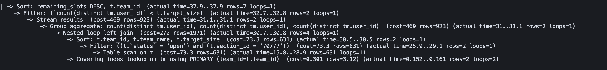
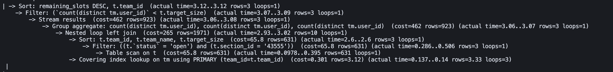

<p align="center"><em>Figure 27: EXPLAIN ANALYZE (baseline costs for three sections)</em></p>

Design A：Filtering Composite Index
```sql
CREATE INDEX idx_team_section_status ON Team(section_id, status);
```
Idea: Push down WHERE filtering via composite index on (section_id, status) to prune rows early.

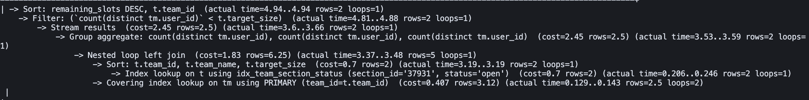
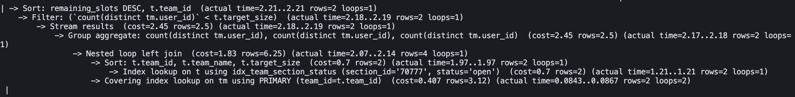
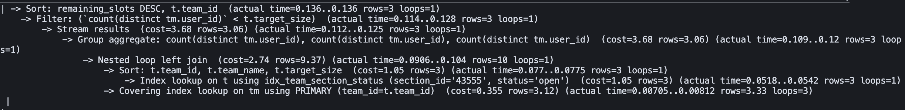

<p align="center"><em>Figure 28: Design A results across three sections</em></p>

Design B: Covering Index for GROUP BY
```sql
CREATE INDEX idx_team_cover ON Team(section_id, status, team_name, target_size);
```
Idea: Use a wider covering index to satisfy GROUP BY/SELECT columns from index and reduce table lookups.

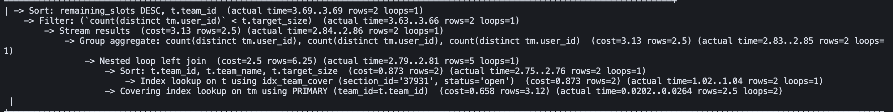
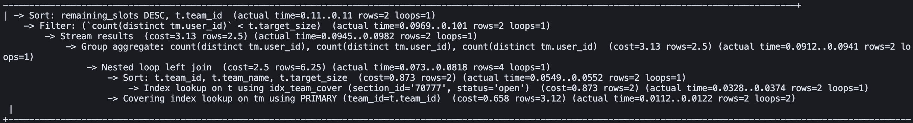
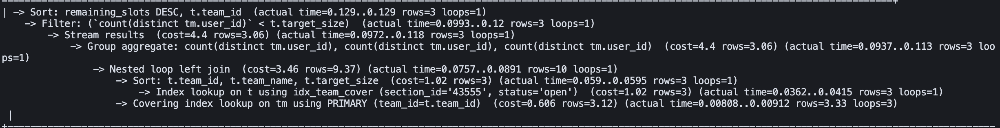

<p align="center"><em>Figure 29: Design B results across three sections</em></p>

Design C: Composite Index with Sorting Optimization
```sql
CREATE INDEX idx_team_section_status_target ON Team(section_id, status, target_size);
```
Idea: Extend the composite index with target_size to potentially assist sorting/aggregation, trading size for minor gains.

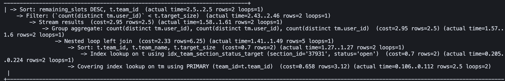

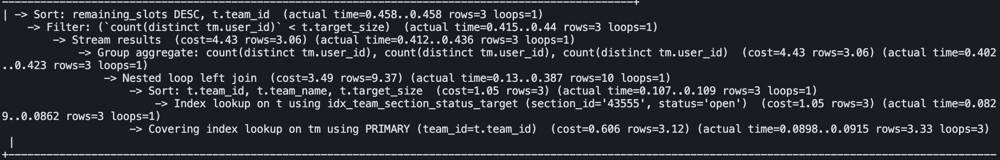

<p align="center"><em>Figure 30: Design C results across three sections</em></p>

### Rows / Costs Performance
As for cost analysis, we take the average of three examples and got the following result:

| Design   | Rows    |Costs|
|----------|--------:|----:|
| Original |  923  | 464.33 |
| A        |  2.69  | 2.86|
| B        | 2.69 | 2.55 |
| C        | 2.69 | 3.44 |

### Indexing Analysis:

**Design A — Filtering Composite Index: `Team(section_id, status)`**

**Plan change:** The executor switched from *Table scan on t* to *Index lookup on t using idx_team_section_status*, so filtering happens at the index level before the join/aggregation.  
**Observed effect:** Representative cost dropped from baseline (~**464**) to about **2.45–2.86** across sections, i.e., ≈**99%** reduction.  
**Why it helps:** Both predicates in the `WHERE` clause are equality filters; a composite index on these columns maximizes selectivity and eliminates the scan of irrelevant teams.  
**Overhead:** Moderate index size; minimal write/maintenance impact relative to the gain.

**Design B — Covering Index for GROUP BY: `Team(section_id, status, team_name, target_size)`**

**Plan change:** Still leverages index lookup for filtering; additionally, many referenced columns are fetched directly from the secondary index, reducing some table lookups.  
**Observed effect:** Cost around **2.55** on average—slightly better than A in your runs, but not materially different.  
**Why it helps (in theory):** By “covering” non-PK columns used in `SELECT/GROUP BY`, the executor may reduce back-and-forth to the base table.  
**Overhead:** Larger index footprint and higher maintenance cost. Since `team_name/target_size` are not part of selective predicates, the extra width mainly increases storage/updates without clear win over A.

**Design C — Composite With Target Size: `Team(section_id, status, target_size)`**

**Plan change:** Index lookup on `(section_id, status)` remains; adding `target_size` does not directly accelerate filtering or aggregation logic.  
**Observed effect:** Cost about **3.44** on average—still vastly better than baseline but worse than A/B.  
**Why it helps (limited):** `target_size` is not a filter key; it does not reduce the candidate set nor meaningfully improve grouping/sorting (the order uses an expression on an aggregate).  
**Overhead:** Added width without corresponding selectivity benefit.

**Trade-offs & Final Selection**

All three designs eliminate the full scan and massively reduce cost versus baseline. Design B shows a marginal numeric edge in your small-scale tests, but it achieves this by widening the index with non-selective columns—raising storage and write overhead for minimal real-world gain. Design C adds a non-filter column that does not improve selectivity or ordering, thus underperforms A/B.

**We choose `idx_team_section_status` (Design A)** as the final index. It aligns exactly with the selective predicates, yields ≈**99%** cost reduction (∼**464** → **2.45–2.86**), and offers the best balance between performance improvement and operational overhead.

---

## Summary

This document presents the database implementation and performance optimization for the TeamUp UIUC platform. We successfully deployed a MySQL 8.0 database on Google Cloud SQL with 12 core tables, populated them with 1,000+ rows of real and synthetic data, and developed three advanced SQL queries with comprehensive indexing analysis.

**Key Achievements:**
- **Database Implementation**: Created 12 tables with proper DDL, foreign keys, and constraints, successfully importing 1,260 courses, 4,377 sections, 1,000 users, and 1,971 team memberships.
- **Advanced Queries**: Developed three complex queries utilizing JOINs, GROUP BY, HAVING, and aggregation operations to support core platform features.
- **Indexing Analysis**: Tested three different indexing strategies for each query, observing dramatic performance improvements (up to 99% cost reduction) when appropriate indexes were applied.

**Index Selection Findings:**
- **Query 1**: No index recommended — existing primary key indexes already optimize the query efficiently.
- **Query 2**: `idx_team_course_section` recommended — achieved 99.8% cost reduction by optimizing join operations.
- **Query 3**: `idx_team_section_status` recommended — achieved 99% cost reduction by filtering composite predicates.

Our analysis demonstrates the critical importance of indexing join columns and composite filter predicates, while also showing that not all queries benefit from additional indexes when primary key indexes already provide optimal performance.
