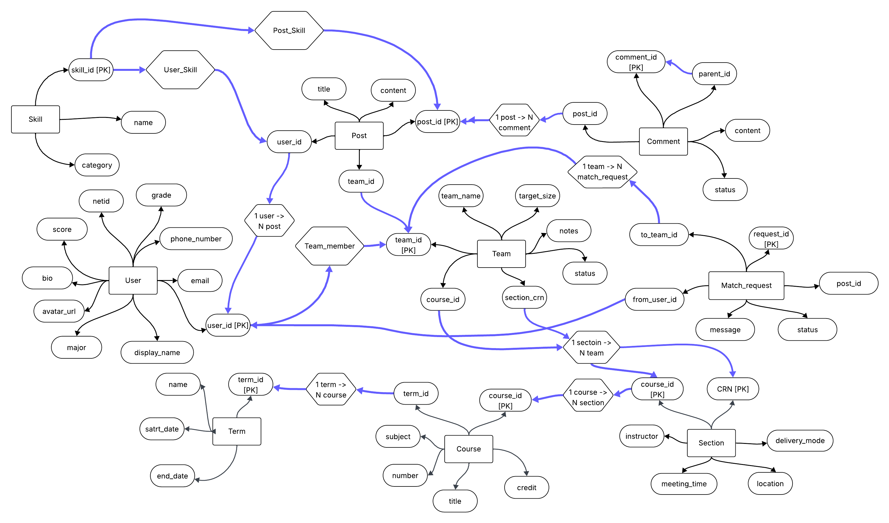

# Conceptual & Logical Database Design

    

# I. ER Model design

## *1.1 Entities*

---

### **Term**

Represents an academic term (e.g., *Spring 2025*). It serves as the top-level grouping for all courses, sections, posts, and teams, providing a consistent temporal scope for filtering and organization.

**Attributes**
- **term_id (PK)** — Unique identifier for a term.
- **name** — Human-readable label (e.g., “Spring 2025”).
- **start_date** — Beginning date of the term.
- **end_date** — Ending date of the term.

---

### **Course**

Represents a specific course offered within a term (e.g., *sp25CS411*). The `course_id` encodes both the subject and term for uniqueness, while `term_id (FK)` keeps an explicit relational link for joins and normalization.

**Attributes**
- **course_id (PK)** — Unique course key including term information (e.g., “sp25CS411”).
- **term_id (FK)** — References the term the course belongs to.
- **subject** — Department or subject code (e.g., “CS”).
- **number** — Course number (e.g., 411).
- **title** — Official course title.
- **credits** — Credit hours assigned to the course.

---

### **Section**

Represents a specific section of a course, including its instructor, time, and meeting location. It is modeled as a weak entity since its identity depends on the parent `Course`.

**Attributes**
- **CRN (PK)** — Course Registration Number (section identifier).
- **course_id (FK, PK)** — References the parent course; part of the composite key.
- **instructor** — Instructor name(s).
- **meeting_time** — Time schedule string (e.g., “MWF 10:00–10:50 AM”).
- **location** — Meeting place (building, room, or online).
- **delivery_mode** — Instruction mode (In-person / Online / Hybrid).

---

### **User**

Represents an authenticated student with a UIUC NetID and editable public profile. Users can author posts, join teams, and manage their skills.

**Attributes**
- **user_id (PK)** — Unique user identifier.
- **netid** — Campus NetID for authentication.
- **email** — Email contact.
- **phone_number** — Optional phone contact.
- **display_name** — User’s chosen display name.
- **avatar_url** — URL to the profile image.
- **bio** — Short personal introduction.
- **score** — Reputation or participation score.
- **major** — Academic major.
- **grade** — Academic level or year.

---

### **Team**

Represents a project or study group created within a course or section. Teams maintain size limits, status, and membership, enabling structured team management.

**Attributes**
- **team_id (PK)** — Unique team identifier.
- **course_id (FK)** — Related course context.
- **section_id (FK)** — Related section context, optional.
- **team_name** — Display name of the team.
- **target_size** — Intended maximum number of members.
- **notes** — Free-form team description or notes.
- **status** — Team’s lifecycle state (e.g., open, locked, full, closed).
- **created_at** — Creation timestamp.
- **updated_at** — Last modification timestamp.

---

### **Skill**

Defines a normalized vocabulary of skills that users can claim or that posts can require. Having skills as an entity ensures consistency and supports filtering/matching.

**Attributes**
- **skill_id (PK)** — Unique skill identifier.
- **name** — Name of the skill (unique).
- **category** — Optional category or classification.

---

### **Post**

Represents a public teammate-seeking post created by a user, optionally linked to a team or section. Posts are searchable and serve as the main interaction unit.

**Attributes**
- **post_id (PK)** — Unique identifier for the post.
- **user_id (FK)** — Authoring user.
- **team_id (FK)** — Linked team.
- **title** — Title of the post.
- **content** — Detailed description or requirements.
- **created_at** — Creation timestamp.
- **updated_at** — Last modification timestamp.

---

### **Comment**

Represents threaded discussions under posts. A self-referencing `parent_comment_id` supports nested comment hierarchies and moderation.

**Attributes**
- **comment_id (PK)** — Unique identifier for the comment.
- **post_id (FK)** — Associated post.
- **user_id (FK)** — Comment author.
- **parent_comment_id (FK self)** — Parent comment reference for nesting (nullable).
- **content** — Comment text.
- **status** — Visibility status (visible, hidden, deleted).
- **created_at** — Creation timestamp.
- **updated_at** — Last modification timestamp.

---

### **Match_request**

Represents a join or contact request from a user to a team, optionally referencing a related post. Although conceptually a relationship, it is modeled as an entity to store its own attributes (status, message, timestamps).

**Attributes**
- **request_id (PK)** — Unique request identifier.
- **from_user_id (FK)** — Sender of the request.
- **to_team_id (FK)** — Target team.
- **post_id (FK)** — Source post context (optional).
- **status** — Request state (pending, accepted, rejected, withdrawn).
- **message** — Optional message body.
- **created_at** — Creation timestamp.

---

##  *1.2 Relationships & Cardinalities*

### A) Posts & Comments

#### **User — Post (1–M)**

A user authors posts to recruit teammates. Each post has exactly one author; a user can author many posts.

- **Cardinality:** 1 (User) — M (Post)
- **Participation:** **Post** side mandatory (every post must have an author); **User** side optional per row (a user may have zero posts)
- **Keys involved:** `Post.user_id (FK)` → `User.user_id (PK)`
- **Notes/Constraints:** Author cannot be changed without updating the FK.

#### **Team — Post (1–M)**
 
Every post is associated with one team (e.g., recruiting into a specific team), while a team can have multiple posts across time.

- **Cardinality:** 1 (Team) — M (Post)
- **Participation:** **Post** side mandatory; **Team** side optional per row
- **Keys involved:** `Post.team_id (FK)` → `Team.team_id (PK)`
- **Notes/Constraints:** Enforces single-team context per post.

#### **Post — Comment (1–M)**

Comments belong to a single post; a post can have many comments.

- **Cardinality:** 1 (Post) — M (Comment)
- **Participation:** **Comment** side mandatory; **Post** side optional per row
- **Keys involved:** `Comment.post_id (FK)` → `Post.post_id (PK)`
- **Notes/Constraints:** Deleting/archiving a post should hide or cascade per policy.

#### **User — Comment (1–M)**

A user writes comments; each comment has exactly one author.

- **Cardinality:** 1 (User) — M (Comment)
- **Participation:** **Comment** side mandatory; **User** side optional per row
- **Keys involved:** `Comment.user_id (FK)` → `User.user_id (PK)`
- **Notes/Constraints:** Supports moderation and audit trails.

#### **Comment — Comment (1–M)**

Nested/threaded comments: a comment may reply to a single parent; a parent can have many replies.

- **Cardinality:** 1 (Parent Comment) — M (Child Comments)
- **Participation:** **Child** mandatory; **Parent** optional (top-level comments have `NULL parent_comment_id`)
- **Keys involved:** `Comment.parent_comment_id (FK self)` → `Comment.comment_id (PK)`
- **Notes/Constraints:** Depth constraints (if any) are handled at the application layer.

---

### B) University Enrollments

#### **Term — Course (1–M)**
 
Courses are offered in specific academic terms; a term includes many courses.

- **Cardinality:** 1 (Term) — M (Course)
- **Participation:** **Course** side mandatory; **Term** side optional per row
- **Keys involved:** `Course.term_id (FK)` → `Term.term_id (PK)`
- **Notes/Constraints:** Matches source catalog structure.

#### **Course — Section (1–M)**

A course has multiple sections; each section belongs to exactly one course.

- **Cardinality:** 1 (Course) — M (Section)
- **Participation:** **Section** side mandatory; **Course** side optional per row
- **Keys involved:** `Section.course_id (FK, PK component)` → `Course.course_id (PK)`
- **Notes/Constraints:** Section uses composite identity per design (`CRN` + `course_id`).

#### **Section — Team (1–M)**

Teams can be tied to a specific section; a section can host many teams.

- **Cardinality:** 1 (Section) — M (Team)
- **Participation:** **Team** side mandatory; **Section** side optional per row
- **Keys involved:** `Team.section_id (FK)` → `Section.course_id/CRN` (per entity definition `section_id/CRN+course_id`)
- **Notes/Constraints:** Ensures team context aligns with section scheduling.

#### **Course — Team (1–M)**
 
Each team is associated with one course; a course can have many teams.

- **Cardinality:** 1 (Course) — M (Team)
- **Participation:** **Team** side mandatory; **Course** side optional per row
- **Keys involved:** `Team.course_id (FK)` → `Course.course_id (PK)`
- **Notes/Constraints:** Coexists with Section–Team for finer scoping.

---

### C) Match Request

#### **User — Match_request (1–M)**

A user can send multiple match requests; each request has exactly one sender.

- **Cardinality:** 1 (User) — M (Match_request)
- **Participation:** **Match_request** side mandatory; **User** side optional per row
- **Keys involved:** `Match_request.from_user_id (FK)` → `User.user_id (PK)`
- **Notes/Constraints:** Sender is immutable after creation.

#### **Team — Match_request (1–M)**

Requests target a specific team; a team can receive many requests.

- **Cardinality:** 1 (Team) — M (Match_request)
- **Participation:** **Match_request** side mandatory; **Team** side optional per row
- **Keys involved:** `Match_request.to_team_id (FK)` → `Team.team_id (PK)`
- **Notes/Constraints:** Team inbox is derived by filtering on this FK.

#### **Post — Match_request (0..1 – M)**

A request may reference the originating post for context (optional); a post can have many associated requests.

- **Cardinality:** 0..1 (Post) — M (Match_request)
- **Participation:** **Match_request** side optional (reference may be NULL); **Post** side optional per row
- **Keys involved:** `Match_request.post_id (FK)` → `Post.post_id (PK)`
- **Notes/Constraints:** Useful for analytics/audit; not required for workflow execution.

---

### D) Relationship Sets (N–M)

#### **User — Team (M–M) via `team_member`**

Users can join many teams; teams have multiple members. Membership has attributes (role, joined_at).

- **Cardinality:** M (User) — M (Team)
- **Participation:** Both sides optional per row
- **Keys involved:** `team_member.team_id (FK)`, `team_member.user_id (FK)`; composite key `(team_id, user_id)` (implied)
- **Notes/Constraints:** `role`, `joined_at` belong to the relationship.

#### **User — Skill (M–M) via `user_skill`**

A user can hold multiple skills; a skill can be held by many users.

- **Cardinality:** M (User) — M (Skill)
- **Participation:** Both sides optional per row
- **Keys involved:** `user_skill.user_id (FK)`, `user_skill.skill_id (FK)`; composite key `(user_id, skill_id)` (implied)
- **Notes/Constraints:** `level` is an attribute of the relationship.

#### **Post — Skill (M–M) via `post_skill`**
 
A post can require multiple skills; a skill can be required by many posts.

- **Cardinality:** M (Post) — M (Skill)
- **Participation:** Both sides optional per row
- **Keys involved:** `post_skill.post_id (FK)`, `post_skill.skill_id (FK)`; composite key `(post_id, skill_id)` (implied)
- **Notes/Constraints:** Keeps `Post` in 1NF; supports filtering and matching.

### 1.3 ER diagram

    
   <em>Figure 1. UML Diagram</em>

---

    
   <em>Figure 2. ER Diagram</em>

---

# II. Normalization (BCNF)

A database schema is in **Boyce–Codd Normal Form (BCNF)** if, for every nontrivial functional dependency (X → Y),  
X must be a **superkey** for the relation.  
Our schema adheres to BCNF.  
We can verify this by checking each table individually as follows:

---

### **Term**
**Functional dependencies:**
- term_id → name, start_date, end_date

**Justification:**  
- term_id is a superkey as it identifies all attributes.  
- No partial or transitive dependencies exist.

---

### **Course**
**Functional dependencies:**
- course_id → term_id, subject, number, title, credits

**Justification:**  
- course_id is a superkey as it identifies all attributes.  
- No partial or transitive dependencies exist.

---

### **Section**
**Functional dependencies:**
- (CRN, course_id) → instructor, meeting_time, location, delivery_mode

**Justification:**  
- The composite key (CRN, course_id) is a superkey of the relation.  
- No partial or transitive dependencies exist.  
- The same CRN may be used for different courses or sections in different semesters.  
- The course_id uniquely identifies the course in the specific semester, which means the composite key is necessary.

---

### **User**
**Functional dependencies:**
- user_id → netid, email, phone_number, display_name, avatar_url, bio, score, major, grade

**Justification:**  
- user_id is a superkey as it identifies all attributes.  
- No partial or transitive dependencies exist.

---

### **Post**
**Functional dependencies:**
- post_id → user_id, team_id, title, content, created_at, updated_at

**Justification:**  
- post_id is a superkey as it identifies all attributes.  
- No partial or transitive dependencies exist.

---

### **Comment**
**Functional dependencies:**
- comment_id → post_id, user_id, parent_comment_id, content, status, created_at, updated_at

**Justification:**  
- comment_id is a superkey as it identifies all attributes.  
- No partial or transitive dependencies exist.

---

### **Team**
**Functional dependencies:**
- team_id → course_id, section_id, team_name, target_size, notes, status, created_at, updated_at

**Justification:**  
- team_id is a superkey as it identifies all attributes.  
- No partial or transitive dependencies exist.

---

### **Skill**
**Functional dependencies:**
- skill_id → name, category

**Justification:**  
- skill_id is a superkey as it identifies all attributes.  
- No partial or transitive dependencies exist.

---

### **Match_request**
**Functional dependencies:**
- request_id → from_user_id, to_team_id, post_id, status, message, created_at

**Justification:**  
- request_id is a superkey as it identifies all attributes.  
- No partial or transitive dependencies exist.

---

### **team_member**
**Functional dependencies:**
- (team_id, user_id) → role, joined_at  

**Justification:**  
- The composite key (team_id, user_id) is a superkey.  
- Each team-user pair is unique, so the composite key uniquely determines all other attributes.  
- There are no other functional dependencies.

---

### **user_skill**
**Functional dependencies:**
- (user_id, skill_id) → level  

**Justification:**  
- The combination of user_id and skill_id uniquely determines the proficiency level.  
- No smaller subset of attributes can do that.  
- No partial or transitive dependencies exist.

---

### **post_skill**
**Functional dependencies:**
- (post_id, skill_id) → ∅ (no extra attributes)  

**Justification:**  
- It’s a trivial functional dependency, but it is still compliant with BCNF.

---

# III. Logical Design — Relational Schema

*Term*  

Term(term_id: VARCHAR(32) [PK], name: VARCHAR(64), start_date: DATE, end_date: DATE)

| Column     | Domain       | Key | Description                                   |
|------------|--------------|-----|-----------------------------------------------|
| term_id    | VARCHAR(32)  | PK  | Unique identifier for each academic term      |
| name       | VARCHAR(64)  |     | Term code or label (e.g., “Spring 2025”)      |
| start_date | DATE         |     | Term start date                               |
| end_date   | DATE         |     | Term end date                                 |

---

*Course*  

Course(course_id: VARCHAR(32) [PK], term_id: VARCHAR(32) [FK to Term.term_id], subject: VARCHAR(16), number: VARCHAR(16), title: VARCHAR(128), credits: DECIMAL(3,1))

| Column   | Domain       | Key                     | Description                                        |
|----------|--------------|-------------------------|----------------------------------------------------|
| course_id| VARCHAR(32)  | PK                      | Unique course identifier (e.g., sp25CS411)         |
| term_id  | VARCHAR(32)  | FK → Term.term_id       | References the term the course belongs to          |
| subject  | VARCHAR(16)  |                         | Subject prefix (CS, ECE, STAT, etc.)               |
| number   | VARCHAR(16)  |                         | Course number                                      |
| title    | VARCHAR(128) |                         | Course title                                       |
| credits  | DECIMAL(3,1) |                         | Credit hours                                       |

---

*Section*  

Section(  
 course_id: VARCHAR(32) [PK, FK to Course.course_id],  crn: VARCHAR(16) [PK],  instructor: VARCHAR(128),  meeting_time: VARCHAR(128),  location: VARCHAR(128),  delivery_mode: VARCHAR(32),  
)

| Column       | Domain       | Key                               | Description                          |
|--------------|--------------|-----------------------------------|--------------------------------------|
| course_id    | VARCHAR(32)  | PK, FK → Course.course_id         | Parent course identifier              |
| crn          | VARCHAR(16)  | PK                                | Course Reference Number               |
| instructor   | VARCHAR(128) |                                   | Instructor name(s)                    |
| meeting_time | VARCHAR(128) |                                   | Meeting schedule                      |
| location     | VARCHAR(128) |                                   | Room information                      |
| delivery_mode| VARCHAR(32)  |                                   | In-person / Online / Hybrid           |

---

*User*  

User(user_id: INT [PK], netid: VARCHAR(64), email: VARCHAR(128), phone_number: VARCHAR(32), display_name: VARCHAR(128), avatar_url: VARCHAR(256), bio: VARCHAR(1024), score: DECIMAL(4,1), major: VARCHAR(64), grade: VARCHAR(16))

| Column        | Domain        | Key | Description                 |
|---------------|---------------|-----|-----------------------------|
| user_id       | INT           | PK  | Unique user ID              |
| netid         | VARCHAR(64)   |     | Campus NetID                |
| email         | VARCHAR(128)  |     | Contact email               |
| phone_number  | VARCHAR(32)   |     | Optional phone number       |
| display_name  | VARCHAR(128)  |     | Public display name         |
| avatar_url    | VARCHAR(256)  |     | Profile image URL           |
| bio           | VARCHAR(1024) |     | Short introduction          |
| score         | DECIMAL(4,1)  |     | Reputation or feedback score|
| major         | VARCHAR(64)   |     | Declared major              |
| grade         | VARCHAR(16)   |     | Academic year or level      |

---

*Skill*  

Skill(skill_id: INT [PK], name: VARCHAR(64), category: VARCHAR(64), created_at: TIMESTAMP)

| Column    | Domain       | Key | Description           |
|-----------|--------------|-----|-----------------------|
| skill_id  | INT          | PK  | Unique skill ID       |
| name      | VARCHAR(64)  |     | Skill name            |
| category  | VARCHAR(64)  |     | Skill category        |
| created_at| TIMESTAMP    |     | Record creation time  |

---

*UserSkill*  

UserSkill(user_id: INT [FK to User.user_id], skill_id: INT [FK to Skill.skill_id], level: VARCHAR(16))

| Column   | Domain | Key                         | Description              |
|----------|--------|-----------------------------|--------------------------|
| user_id  | INT    | PK, FK → User.user_id           | References user          |
| skill_id | INT    | PK, FK → Skill.skill_id         | References skill         |
| level    | VARCHAR(16) |                        | Skill proficiency level  |

---

*Team*  

Team(team_id: INT [PK],  course_id: VARCHAR(32) [FK to Section.course_id], section_id: VARCHAR(16) [FK to Section.crn], team_name: VARCHAR(128), target_size: INT,  notes: VARCHAR(1024),  status: VARCHAR(16), created_at: TIMESTAMP, updated_at: TIMESTAMP)

| Column     | Domain       | Key                              | Description                |
|------------|--------------|----------------------------------|----------------------------|
| team_id    | INT          | PK                               | Unique team identifier     |
| course_id  | VARCHAR(32)  | FK → Section.course_id           | Associated course (via Section) |
| section_id | VARCHAR(16)  | FK → Section.crn                 | Associated section (CRN)   |
| team_name  | VARCHAR(128) |                                  | Name of the team           |
| target_size| INT          |                                  | Expected team size         |
| notes      | VARCHAR(1024)|                                  | Additional information     |
| status     | VARCHAR(16)  |                                  | Open / Full / Closed       |
| created_at | TIMESTAMP    |                                  | Record creation time       |
| updated_at | TIMESTAMP    |                                  | Last update time           |

---

*TeamMember*  

TeamMember(team_id: INT [PK, FK to Team.team_id], user_id: INT [PK, FK to User.user_id], role: VARCHAR(32), joined_at: TIMESTAMP)

| Column   | Domain | Key                          | Description            |
|----------|--------|------------------------------|------------------------|
| team_id  | INT    | PK, FK → Team.team_id        | Team reference         |
| user_id  | INT    | PK, FK → User.user_id        | User reference         |
| role     | VARCHAR(32) |                          | Role in the team       |
| joined_at| TIMESTAMP |                            | Join date              |

---

*Post*  

Post(post_id: INT [PK], user_id: INT [FK to User.user_id], team_id: INT [FK to Team.team_id],  
 title: VARCHAR(128),  
 content: VARCHAR(4000),  
 created_at: TIMESTAMP,  
 updated_at: TIMESTAMP  
)

| Column    | Domain       | Key                   | Description          |
|-----------|--------------|-----------------------|----------------------|
| post_id   | INT          | PK                    | Unique post ID       |
| user_id   | INT          | FK → User.user_id     | Author of the post   |
| team_id   | INT          | FK → Team.team_id     | Related team         |
| title     | VARCHAR(128) |                       | Post title           |
| content   | VARCHAR(4000)|                       | Main text            |
| created_at| TIMESTAMP    |                       | Creation time        |
| updated_at| TIMESTAMP    |                       | Last update time     |

---

*Comment*  

Comment(comment_id: INT [PK], post_id: INT [FK to Post.post_id], user_id: INT [FK to User.user_id], parent_comment_id: INT [FK to Comment.comment_id], content: VARCHAR(2000), status: VARCHAR(16), created_at: TIMESTAMP, updated_at: TIMESTAMP)

| Column            | Domain        | Key                         | Description                    |
|-------------------|---------------|-----------------------------|--------------------------------|
| comment_id        | INT           | PK                          | Unique comment ID              |
| post_id           | INT           | FK → Post.post_id           | Related post                   |
| user_id           | INT           | FK → User.user_id           | Author                         |
| parent_comment_id | INT           | FK → Comment.comment_id     | Parent comment (nullable)      |
| content           | VARCHAR(2000) |                             | Comment text                   |
| status            | VARCHAR(16)   |                             | Visibility status              |
| created_at        | TIMESTAMP     |                             | Creation time                  |
| updated_at        | TIMESTAMP     |                             | Last update time               |

---

*MatchRequest*  

MatchRequest(request_id: INT [PK], from_user_id: INT [FK to User.user_id], to_team_id: INT [FK to Team.team_id], post_id: INT [FK to Post.post_id], message: VARCHAR(1024), status: VARCHAR(16), created_at: TIMESTAMP)

| Column       | Domain       | Key                     | Description                 |
|--------------|--------------|-------------------------|-----------------------------|
| request_id   | INT          | PK                      | Unique request ID           |
| from_user_id | INT          | FK → User.user_id       | Request sender              |
| to_team_id   | INT          | FK → Team.team_id       | Request target team         |
| post_id      | INT          | FK → Post.post_id       | Optional source post        |
| message      | VARCHAR(1024)|                         | Message content             |
| status       | VARCHAR(16)  |                         | Pending / Accepted / etc.   |
| created_at   | TIMESTAMP    |                         | Request creation time       |

---

*PostSkill*  

PostSkill(post_id: INT [PK, FK to Post.post_id], skill_id: INT [PK, FK to Skill.skill_id])

| Column  | Domain | Key                               | Description                 |
|---------|--------|-----------------------------------|-----------------------------|
| post_id | INT    | PK, FK → Post.post_id             | References post             |
| skill_id| INT    | PK, FK → Skill.skill_id           | References required skill   |

---

---

# IV. Assumptions Summary

### **Entity-level assumptions**

- **Term** – Each term has a unique `term_id`. Term names such as *Spring 2025* are unique within the database and represent the top-level temporal grouping for all courses and sections.  
- **Course** – `course_id` encodes both the term and subject for uniqueness (e.g., `sp25CS411`). The same subject/number may reappear in different terms.  
- **Section** – Each section belongs to exactly one course. Its identity depends on the parent course (weak entity).  
  - *If using single-key design (section_id)* : each `section_id` uniquely identifies a section; `(course_id, crn)` is unique per term.  
  - *If using composite-key design (course_id + crn)* : `(course_id, crn)` forms the primary key and is unique within a term.  
- **User** – Each user has a unique `user_id` (UUID or integer). Email and NetID are unique. Users can create posts, join teams, and list skills.  
- **Team** – Each team is created within a course or section context. A team has a lifecycle state (`open / full / closed`) and an intended maximum size.  
- **Skill** – Skill names are globally unique; `category` is optional for grouping.  
- **Post** – Each post is authored by one user. `team_id` is optional (`0..1–M` relationship to Team) to allow both general and team-specific recruiting posts.  
- **Comment** – Each comment belongs to one post and one author, and may reference a parent comment (`parent_comment_id`) to form nested threads.  
- **MatchRequest** – Stored as an entity to track its own `status`, `message`, and `timestamps`, even though conceptually it represents a relationship (User → Team).  
- **TeamMember** – Bridge table for the M–M relationship between User and Team, with attributes `role` and `joined_at`.  
- **UserSkill** – Bridge table for the M–M relationship between User and Skill, with attribute `level` indicating proficiency.  
- **PostSkill** – Bridge table for the M–M relationship between Post and Skill, allowing posts to specify multiple required skills.

---

### **Relationship-level assumptions**

- **Term → Course (1–M)** – Each course is offered in one term; a term can contain multiple courses.  
- **Course → Section (1–M)** – A course may have multiple sections; each section belongs to one course.  
- **Section → Team (1–M)** – Teams operate within one section; a section can host multiple teams.  
- **Course → Team (1–M)** – Each team belongs to one course; a course can have many teams.  
- **User → Post (1–M)** – A user may author many posts; each post has exactly one author.  
- **Team → Post (0..1–M)** – A post may or may not belong to a team (optional FK `team_id`).  
- **Post → Comment (1–M)** – A post can have multiple comments; each comment references one post.  
- **User → Comment (1–M)** – Each comment is written by one user.  
- **Comment → Comment (1–M)** – Nested comments form a hierarchy; top-level comments have `NULL parent_comment_id`.  
- **User ↔ Team (M–M via TeamMember)** – Many users can join many teams.  
- **User ↔ Skill (M–M via UserSkill)** – Many users can possess many skills.  
- **Post ↔ Skill (M–M via PostSkill)** – A post can list multiple required skills.  
- **User → MatchRequest (1–M)** – One user can send multiple requests.  
- **Team → MatchRequest (1–M)** – One team can receive multiple requests.  
- **Post → MatchRequest (0..1–M)** – A request may link to one post for context.

---

### **General assumptions**

- All IDs (`*_id`) are globally unique and used as primary keys.  
- Foreign keys are optional only when the business rule allows (e.g., `Post.team_id`).  
- All timestamps (`created_at`, `updated_at`) are system-generated for record history.  
- `status` fields use enumerated values validated at the application level.  
- Deletions are *soft* (flag or status change) to preserve history.  
- All tables are normalized to BCNF; no redundant non-key attributes.  

---

