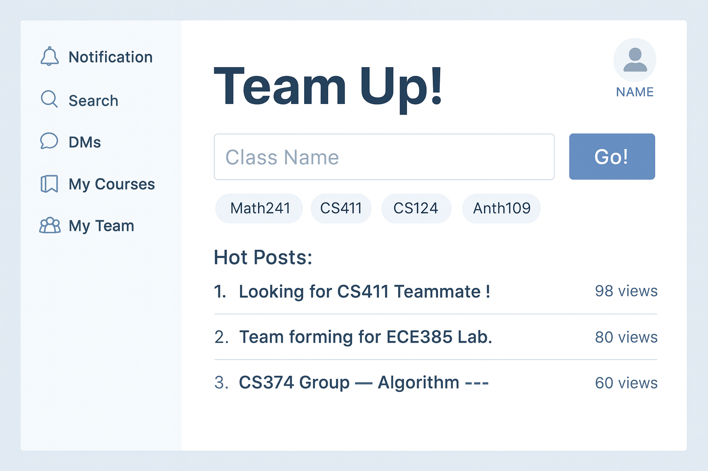
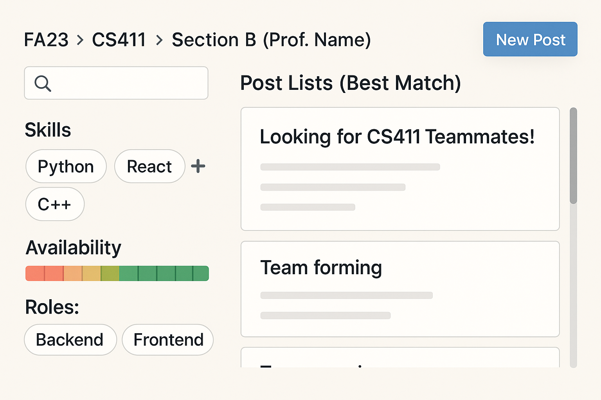
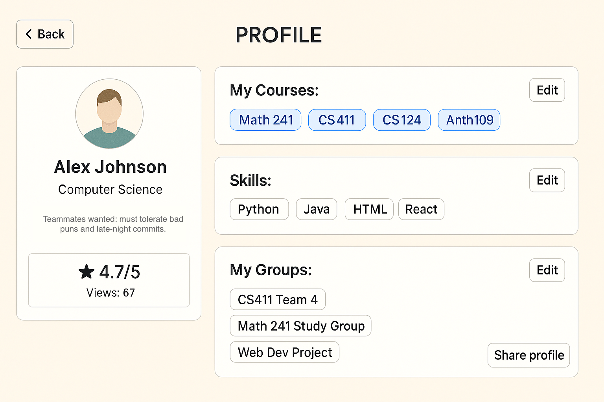

# TEAMUP! UIUC!

**Repository:** `fa25-cs411-team001-SQLMaster`

---

## Team Members
- ningwei3
- jackj6
- lixuang2
- tao17

---

# I. Project Summary
Team Up! UIUC! is a course-based teammate finder organized by term, course and section web platform for University of Illinois students to efficiently connect and form project teams within their classes. Organized by semester, course, and section, it allows users to post or search for teammates based on skills, availability, and preferences. Beyond simple posting, the platform supports team management, enabling students to track team formation progress and join groups that match their strengths. We hope our platform will create a collaborative and efficient environment for students to have better communication with peers and a more positive experience on classes and interesting projects. 

---

# II. Description
Motivated by students’ common concern—“I want to find good project teammates in my class”—our application addresses a recurring problem at UIUC: the difficulty of finding and organizing project teammates within the same course section. TeamUp! UIUC! provides a centralized, course-based teammate finder where students can create and browse posts by term, course, and section, filter by personal preferences on skills, availability and group work habits, and track team status throughout the formation process. By offering organized posts, personal profiles, and a progress tracker, the platform makes team formation more transparent and efficient.

On the technical side, the frontend is implemented in React and JavaScript for a clear user interface, while the backend uses Python to handle authentication, post and team lifecycle management, and join requests. Data is stored in MySQL to support our featured functions. Together, this system helps students with the current team formation concerns. 

# III. Usefulness

# IV. Creative Component

# V. Data Sources

# VI. Data Model

| Entity       | Purpose                                                         | Key Attributes                                                                                                             | Primary Relationships                                                                                 |
|--------------|-----------------------------------------------------------------|----------------------------------------------------------------------------------------------------------------------------|--------------------------------------------------------------------------------------------------------|
| **Term**     | Academic term used to scope courses, posts, and teams.          | id (PK), code (e.g., FA25), name, start_date, end_date                                                                     | 1–N: Term → Course, Term → Post, Term → Team                                                          |
| **Course**   | A course instance within a term (e.g., CS 411).                 | id (PK), term_id (FK→Term), subject, number, title                                                                         | 1–N: Course → Section, Course → Post, Course → Team; N–1: Course → Term                               |
| **Section**  | A specific section/instructor/time slot of a course.            | id (PK), course_id (FK→Course), section_code, instructor                                                                    | N–1: Section → Course; 1–N (optional): Section → Post/Team                                            |
| **User**     | Authenticated student profile tied to NetID.                    | id (PK), netid (unique), email (opt), display_name, bio, team                                                               | 1–N: User → Post, User → MatchRequest (as sender); N–M: User ↔ Team (via TeamMember); 1–N: User → UserSkill |
| **Post**     | Teammate-seeking ad within a term/course/(optionally section).  | id (PK), user_id (FK→User), term_id (FK→Term), course_id (FK→Course), section_id (FK→Section, null), title, content, status | N–1: Post → User/Course/Term/(Section); 1–N (optional): Post → MatchRequest (referenced)               |
| **Team**     | A recruiting or formed team with capacity/status.               | id (PK), owner_user_id (FK→User), term_id (FK→Term), course_id (FK→Course), section_id (FK→Section, null), target_size, status | N–M: Team ↔ User (via TeamMember); 1–N: Team → MatchRequest (as target)                               |
| **TeamMember** | Junction table linking users to teams with role.             | team_id (FK→Team), user_id (FK→User), role, joined_at (PK: team_id + user_id)                                               | Implements N–M: Team ↔ User                                                                            |
| **MatchRequest** | Contact/join workflow between users and/or teams.          | id (PK), from_user_id (FK→User), to_user_id (FK→User, null XOR), to_team_id (FK→Team, null XOR), post_id (FK→Post, null), status | N–1: MatchRequest → User (from), → User or Team (to), → Post (optional)                                |
| **Skill**    | Normalized skill tags for profiles and search.                  | id (PK), name (unique)                                                                                                      | 1–N: Skill → UserSkill                                                                                |
| **UserSkill**| Junction table linking users to skills (with level).            | user_id (FK→User), skill_id (FK→Skill), level (PK: user_id + skill_id)                                                      | Implements N–M: User ↔ Skill                                                                          |

# VII. Functionality 

## 1. Roles & Permissions
- **Student (NetID-authenticated)**: Navigate by term/course/section; create/browse/search posts; send/receive join requests; create/manage teams; edit profile (skills, availability); comment (optional); bookmark (optional).
- **Team Owner**: Everything a Student can do **plus** lock/close team, remove members, adjust target size, manage role needs (optional).
- **System (ETL/Service)**: Sync public **Term/Course/Section** data; run background jobs (capacity/status updates, request expiry).

---

## 2. Feature List 

### A) Discover & Navigate
- **Term → Course → Section** navigation to see the space’s Posts and Teams.
- **Search/Filter**: keyword (title/content), skill tags, status (open/locked), remaining slots, recency (updated_at), optionally by section.
- **Course/Section info**: title, instructor, meeting times (from official data).

### B) Posts 
- **Create**: Student creates one active post within a term/course (section optional).
- **Read**: List & detail views (title, content, skills, target size, author summary).
- **Update**: Author edits title/content/skills, switches `open/locked`, or archives.
- **Delete**: Author deletes or archives; archived posts are hidden from default lists.

### C) Teams
- **Create**: From a post or standalone; set `target_size` and notes.
- **Read**: Show members, open slots (`target_size - current_members`), status (`open/locked/full/closed`).
- **Update**: Owner locks/unlocks, changes target size/notes; membership changes trigger **auto-full** when capacity is reached.
- **Delete/Close**: Owner closes (`closed`); hard delete only in dev—production uses close.

### D) Membership 
- **Add**: Accept a request or invite approved user into the team.
- **Read**: Team page lists members & roles.
- **Update**: Owner edits a member’s role (FE/BE/PM…).
- **Delete**: Owner removes member; member can leave team.

### E) Match Requests 
- **Create**: **User→User** or **User→Team** (XOR target), with optional message and source post reference.
- **Read**: Inbox (received) and Sent boxes; filter by status/time, paginated.
- **Update**: Target **accept/reject**; sender **withdraw**; system **expire**.
- **Delete**: No hard delete; state transitions to `withdrawn/expired` (audit trail).
- **Side-effects**: `accepted` → auto-add to `TeamMember` and notify both sides.

### F) Profiles 
- **Create**: First login initializes a user profile.
- **Read**: Author cards on posts; full profile page for self/others (public fields only).
- **Update**: Edit `display_name`, `bio`, `avatar` (opt); manage **UserSkill** and **AvailabilityBlock**.
- **Deactivate**: Soft-deactivate (hide public info, keep history).

### G) Comments, Bookmarks, Notifications
- **Comments**: Threaded discussion under posts; author/admin may hide/delete.
- **Bookmarks**: Save posts or teams for quick access.
- **Notifications**: In-app alerts for new requests, accepted/rejected, team full, etc.

> **Beyond posts & replies (explicitly addressed):**  
> 1) **Team capacity automation** (open slots/full transitions),  
> 2) **Skill-based filters**,  
> 3) **Availability overlap hints** (optional; based on AvailabilityBlock and section meeting times).

---

## 3. CRUD Matrix

### a Posts
| Actor | Action | Data | When (intent) | Inputs | Validations / Rules | Side-effects |
|---|---|---|---|---|---|---|
| Student | **Create** | Post | Wants to find teammates in a course | `term_id`, `course_id`, `(section_id)`, `title`, `content`, `skills[]`, `target_team_size` | ≤1 active post per `(user, term, course[, section])`; title required; length limits | Create `PostSkill`; optional notifications |
| Any | **Read** | Post | Browse/search | filters: term/course/section/status/skills/q, sort | Respect visibility | — |
| Author | **Update** | Post | Edit info/status | title/content/skills/visibility/status | State machine: `open↔locked`, `→ archived` | Bumps `updated_at` |
| Author | **Delete/Archive** | Post | No longer recruiting | — | Prefer archive (soft) | Hidden from default lists |

### b Teams & Membership
| Actor | Action | Data | When | Inputs | Validations / Rules | Side-effects |
|---|---|---|---|---|---|---|
| Student | **Create** | Team | Forms a team | `term_id`, `course_id`, `(section_id)`, `target_size`, `notes` | `target_size` ∈ [1,10] | Initial member = owner; status `open` |
| Any | **Read** | Team | Browse | filters: term/course/section/status | — | Show `open_slots`, members |
| Owner | **Update** | Team | Lock/unlock, resize | `target_size`/`status`/`notes` | `status` ∈ {open, locked, full, closed} | Hitting capacity → `full` |
| Owner | **Delete/Close** | Team | Ends or moves off-platform | — | Prefer `closed`; hard delete only in dev | Remove members or preserve history |
| Owner | **Add** | TeamMember | Accept/invite success | `user_id`, `role` | Unique `(team_id, user_id)`; team not full | `open_slots--`; may set `full` |
| Owner/Member | **Delete** | TeamMember | Kick/leave | `user_id` | Owner cannot self-kick without transfer/close | `open_slots++`; may reopen if was `full` |

### c Match Requests
| Actor | Action | Data | When | Inputs | Validations / Rules | Side-effects |
|---|---|---|---|---|---|---|
| Student | **Create** | MatchRequest | Initiate contact | `from_user_id`, `(to_user_id XOR to_team_id)`, `message`, `post_id?` | XOR target; de-duplicate identical pending (app-level) | Notify target |
| Target | **Update** | MatchRequest | Accept/Reject | `status=accepted|rejected` | Only target may decide | `accepted` → add `TeamMember` |
| Sender | **Update** | MatchRequest | Withdraw | `status=withdrawn` | Only sender may withdraw | Notify target |
| System | **Update** | MatchRequest | Expire | `status=expired` | `expires_at` passed | Hide from default inbox views |
| Any | **Read** | MatchRequest | Inbox/Sent | filters: status/time | — | — |

### d Profiles
| Actor | Action | Data | When | Inputs | Validations / Rules | Side-effects |
|---|---|---|---|---|---|---|
| System | **Create** | User | First login | `netid`, `email?` | `netid` unique | Initialize empty profile |
| User | **Update** | User | Edit profile | `display_name`, `bio`, `avatar_url` | Format/length checks | Updates author card |
| User | **Upsert** | UserSkill | Maintain skills | `skills[]`, `level?` | Unique `(user_id, skill_id)` | Enables filtering & match explainability |
| User | **Upsert** | AvailabilityBlock | Maintain availability | `day_of_week`, `start_min`, `end_min` | Valid range; merge overlaps | Drives availability hints |
| Any | **Read** | User/Profile | View self/others | `user_id` | Show public fields only | Used in post/team cards |

---

## 4. Search / Filter / Sort 
- **Posts list**: filter by `term_id`, `course_id`, `(section_id?)`, `status=open`, `skills[]`, `q`; sort by `updated_at DESC`; paginate.
- **Teams list**: filter by `term_id`, `course_id`, `(section_id?)`, `status IN (open, locked)`, `open_slots > 0`; sort by `updated_at DESC`.
- **Inbox**: `to_user_id` **or** `to_team_id` + `status IN (pending)` + `created_at DESC`; paginate.
- **Members view**: `team_id` join `TeamMember` → user cards with roles.

# VIII. UI Mockups

Our Team Up! platform gives students a simple way to find teammates. The left menu has main tools like notifications, search, direct messages (DMs), My Courses, and My Teams, so students can quickly reach what they need.

At the top, a large search bar lets students look up courses by name or code, or browse by course tags. Below, popular posts are shown with team requests and view counts. Students can open these posts to learn more and send a join request or message.

The "Course Section" page is for working within one class. Students can filter posts by skills, time, or role, and see posts ranked by best match. They can also create new posts for assignments. This setup is more than just posting and replying—it supports profiles, skill filters, and reputation-based teamwork.

On the "Profile" page, students can list their courses, skills, groups, and add a short description with a reputation score. They can edit skills, manage groups, and share their profile, which makes teaming more open and fair.

---

# IV. Architecture & APIs

### Frontend
- Built with React and JavaScript.
- Lets students browse courses, make posts, join teams, and manage applications.
- Talks to the backend using REST APIs.

### Backend
- Built with FastAPI (Python).
- Handles main logic like login, posts, teams, and applications.
- Calculates match scores and gives APIs for the frontend.

### Database
- Uses MySQL 8 to keep data such as Users, Courses, Sections, Posts, Teams, Applications, Skills, and Availability.
- Keeps data linked, supports filters, and powers the matching system.

### Deployment
- Runs in Docker for easy setup.
- Uses Docker Compose locally and AWS/Render in the cloud.
- GitHub Actions pipeline for tests and auto builds.

### Main APIs

#### Auth APIs
- Login with NetID (SSO) and create JWT tokens for sessions.

#### Course & Section APIs
- Get semesters, courses, and sections.
- Manage student enrollments.

#### Profile APIs
- Edit skills, role choices, time slots, and self-intro.

#### Post & Search APIs
- Make or update team-finding posts.
- Search/filter by course, section, skill, date, or time.

#### Team APIs
- Form and manage teams.
- Add members, set team size, and auto-close when full.

#### Application APIs
- Send and track join requests.
- Approve, reject, or cancel requests.
