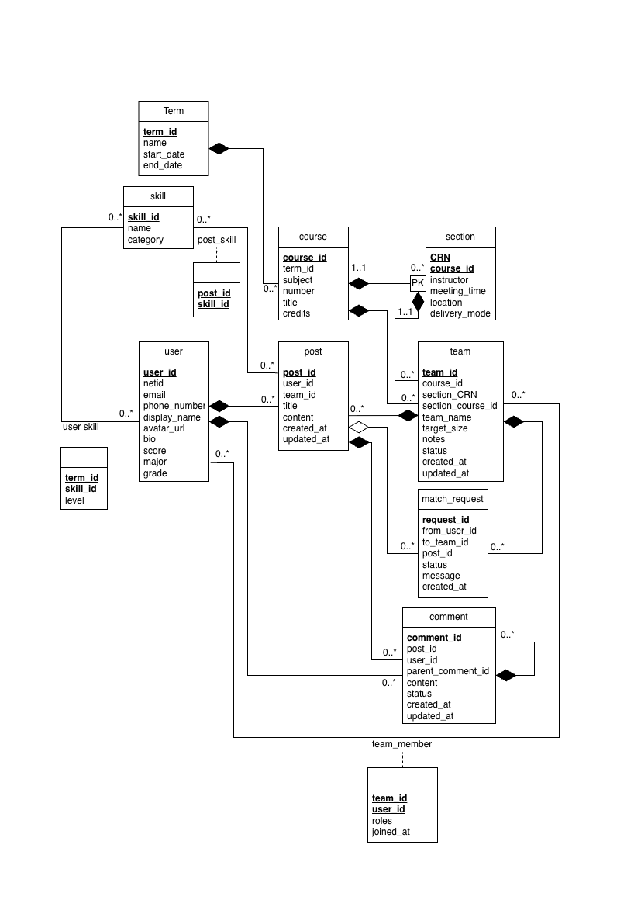
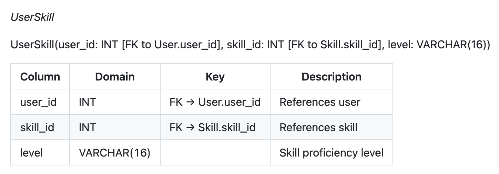
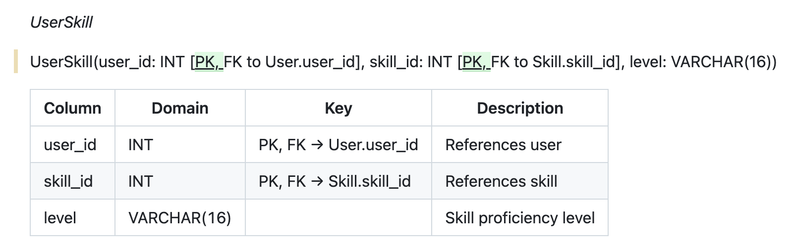

# Stage2 Datamodel Design Revision

In response to the feedback we received for Stage 2, we have revised our (doc/datamodel_design.md) file to address the points deducted in the previous submission.
This document (doc/stage2_revisions.md) briefly summarizes where we lost points and explains the corresponding corrections and improvements made in our updated design.

## Problem 1: "Your UML includes foreign keys and data types, which are implementation details. Keep the conceptual diagram free of FKs or SQL domains."(-1)

Our original UML diagram included foreign keys and data types, which are implementation-level details and should not appear in a conceptual model.

We have modified our UML, removed all FK and SQL domain annotations from the UML to make it a purely conceptual representation, as required. Following shows our old UML and our updated UML(remove implementation details related to foreign keys). 

### Old UML diagram

    

### Modified UML diagram

    

## Problem 2: "In UserSkill, the two FKs should also form a composite primary key since it’s a many-to-many table."(-1)

In previous design, the UserSkill table did not define a composite primary key even though it represents a many-to-many relationship between User and Skill.

We updated the Logical Design — Relational Schema section to specify that (user_id, skill_id) together form the composite primary key, aligning with standard relational design principles.

Updated **III. Logical Design — Relational Schema** as follow:

### Old version: 

    

### Modified version:

    

